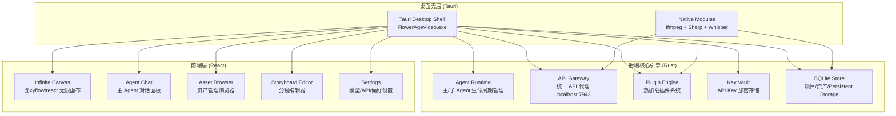
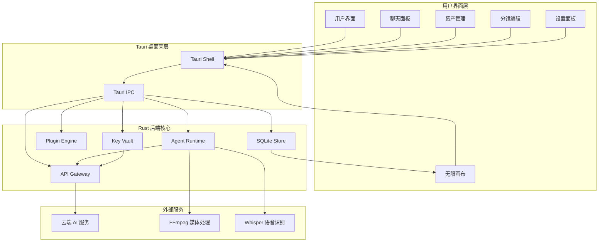
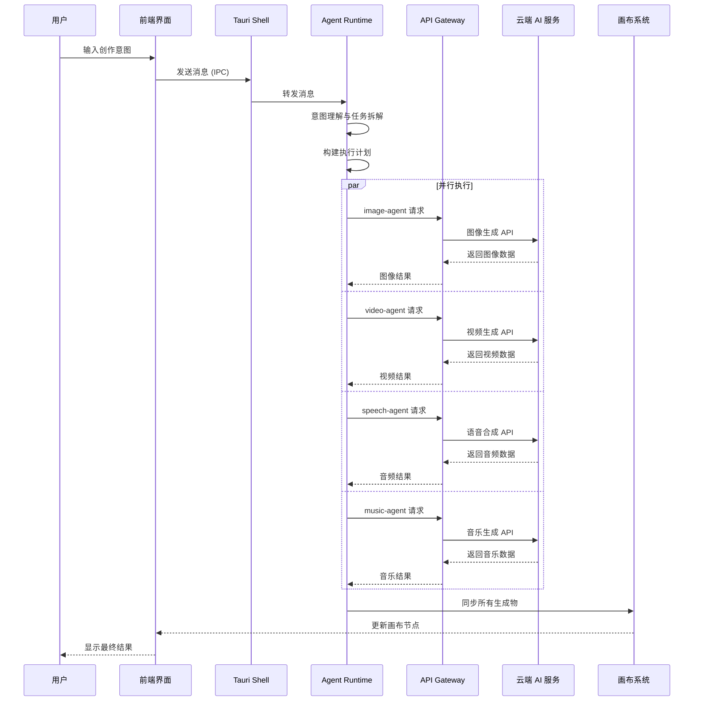
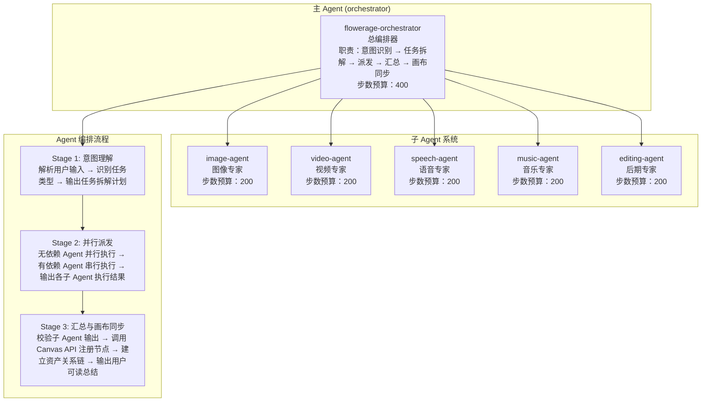
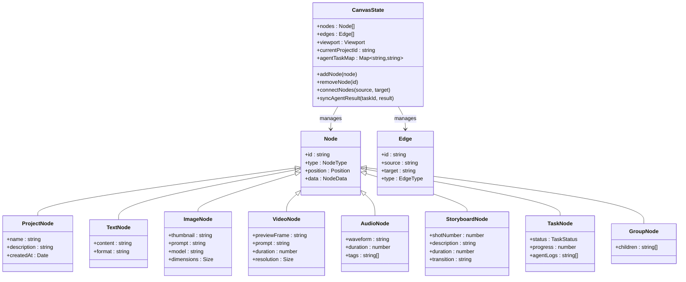
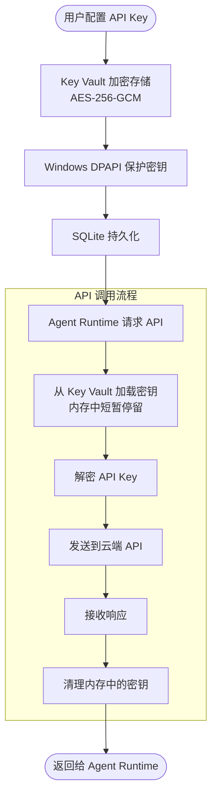

# 整体架构概览

<cite>
**本文档引用的文件**
- [buzhidaozenmemingmin.md](file://buzhidaozenmemingmin.md)
</cite>

## 目录
1. [项目简介](#项目简介)
2. [项目结构](#项目结构)
3. [核心组件](#核心组件)
4. [架构概览](#架构概览)
5. [详细组件分析](#详细组件分析)
6. [依赖关系分析](#依赖关系分析)
7. [性能考量](#性能考量)
8. [故障排除指南](#故障排除指南)
9. [结论](#结论)

## 项目简介

Flower Age Video（花纪视频工作室）是一款基于 Tauri 框架的 AI 驱动无限画布创意工作站。该应用面向视频创作者、内容生产者和 AI 艺术家，在本地 Windows 桌面上提供一个无限画布，用户通过主 Agent 描述创作意图，由多个专业子 Agent 自动完成图像生成、视频生成、语音合成、音乐生成和后期制作的全链路协作。

### 核心价值主张

| 维度 | 说明 |
|---|---|
| **零商业侵权** | 全部依赖采用 MIT / Apache-2.0 / BSD 许可证，无 GPL 传染风险 |
| **本地部署** | 单文件 .exe 安装，无需 Docker、无需 Python 环境、无需 Node.js 运行时 |
| **云端 AI** | 用户配置自己的 API Key，本地加密存储，无第三方代理 |
| **无限画布** | 所有资产（图片/视频/音频/文本/分镜）在画布上可视化管理 |
| **主 Agent 控子 Agent** | 1 个编排器拆解任务 → 5 个专业子 Agent 并行/串行执行 |

## 项目结构

项目采用三层架构设计，每层都有明确的职责分工：



**图表来源**
- [buzhidaozenmemingmin.md:29-50](file://buzhidaozenmemingmin.md#L29-L50)

**章节来源**
- [buzhidaozenmemingmin.md:354-472](file://buzhidaozenmemingmin.md#L354-L472)

## 核心组件

### 桌面壳层 (Tauri Shell)
- **Tauri 2.x (Rust)**: 桌面窗口容器、系统托盘、自动更新、原生 IPC
- **WebView2**: Windows 内置浏览器，零额外依赖
- **打包工具**: Tauri Bundler 生成 .msi/.exe 安装包
- **自动更新**: Tauri Updater 增量更新，无需额外服务器

### 后端核心引擎 (Rust)
- **Agent Runtime**: Agent 生命周期管理、工具调度、SP 注入、步数限制
- **API Gateway**: 本地 API 代理，路由到各 AI 供应商 API
- **Plugin Engine**: 支持 `.wasm` 插件热加载，扩展新 AI 模型接入
- **Key Vault**: API Key 本地加密存储，Windows DPAPI 加持
- **SQLite Store**: 项目数据、资产索引、Memory、会话历史持久化

### 前端层 (React)
- **Infinite Canvas**: @xyflow/react 无限画布，节点式画布，拖拽/缩放/连线/分组
- **Agent Chat**: React + SSE 实时 Agent 对话与进度反馈
- **Asset Browser**: 资产管理浏览器
- **Storyboard Editor**: 分镜编辑器
- **Settings**: 模型/API/偏好设置

**章节来源**
- [buzhidaozenmemingmin.md:52-65](file://buzhidaozenmemingmin.md#L52-L65)

## 架构概览

### 整体架构设计



**图表来源**
- [buzhidaozenmemingmin.md:27-50](file://buzhidaozenmemingmin.md#L27-L50)

### 请求链路流程



**图表来源**
- [buzhidaozenmemingmin.md:66-83](file://buzhidaozenmemingmin.md#L66-L83)

**章节来源**
- [buzhidaozenmemingmin.md:27-83](file://buzhidaozenmemingmin.md#L27-L83)

## 详细组件分析

### Agent 体系架构

Flower Age Video 采用主 Agent + 子 Agent 的分层架构设计：



**图表来源**
- [buzhidaozenmemingmin.md:139-190](file://buzhidaozenmemingmin.md#L139-L190)

#### Agent 系统提示词设计

每个 Agent 的系统提示词包含六个核心要素：

1. **角色定义 + 能力边界**: 明确 Agent 的职责范围和能力限制
2. **工具使用 SOP**: 标准操作流程，确保一致性的工具调用方式
3. **降级矩阵**: 失败兜底策略，处理各种异常情况
4. **输出格式规范**: 统一的数据格式和结构要求
5. **安全红线**: 不可覆盖的约束条件和安全边界
6. **步数预算提醒**: 严格的执行步数限制

**章节来源**
- [buzhidaozenmemingmin.md:137-210](file://buzhidaozenmemingmin.md#L137-L210)

### 无限画布设计

基于 @xyflow/react 的无限画布系统支持以下核心功能：



**图表来源**
- [buzhidaozenmemingmin.md:213-262](file://buzhidaozenmemingmin.md#L213-L262)

#### 画布节点类型

| 节点类型 | 图标 | 功能 | 数据承载 |
|---|---|---|---|
| **ProjectNode** | 📁 | 项目根节点 | 项目名称/描述/创建时间 |
| **TextNode** | 📝 | 文本/脚本/创意 | Markdown 内容 |
| **ImageNode** | 🖼️ | 图像资产 | 缩略图 + 提示词 + 模型 + 尺寸 |
| **VideoNode** | 🎬 | 视频资产 | 预览帧 + 提示词 + 时长 + 分辨率 |
| **AudioNode** | 🎵 | 音频资产 | 波形 + 时长 + 情绪标签 |
| **StoryboardNode** | 🎞️ | 分镜节点 | 镜头号 + 描述 + 时长 + 转场 |
| **TaskNode** | ⚙️ | Agent 任务节点 | 任务状态 + 进度 + Agent 日志 |
| **GroupNode** | 📦 | 分组容器 | 子节点集合 |

**章节来源**
- [buzhidaozenmemingmin.md:213-238](file://buzhidaozenmemingmin.md#L213-L238)

### API 网关与安全存储



**图表来源**
- [buzhidaozenmemingmin.md:268-350](file://buzhidaozenmemingmin.md#L268-L350)

#### 支持的 AI 供应商

**大语言模型（LLM）**
- OpenAI: GPT-4o / GPT-4.1
- Anthropic: Claude 4 Sonnet / Opus
- DeepSeek: DeepSeek-V3 / V4
- 通义千问: Qwen-Max
- MiniMax: MiniMax-Text-01

**图像生成**
- OpenAI: DALL·E 3
- Stability AI: SD3 / SDXL
- Midjourney: 第三方代理
- 即梦/豆包: Seedream
- Recraft: V3

**视频生成**
- Runway: Gen-3 / Gen-4
- 可灵: Kling 2.x
- 即梦: Seedance 2.0
- MiniMax: Video-01
- Luma: Dream Machine

**语音合成**
- MiniMax: speech-2.8-hd
- ElevenLabs: Multilingual v2
- OpenAI: TTS-1 / TTS-1-hd

**音乐生成**
- Suno: V4
- Udio: V2
- MiniMax: music-2.6

**章节来源**
- [buzhidaozenmemingmin.md:266-337](file://buzhidaozenmemingmin.md#L266-L337)

## 依赖关系分析

### 技术栈依赖

```mermaid
graph TB
subgraph "桌面框架"
Tauri[Tauri 2.x<br/>MIT + Apache-2.0]
WebView2[WebView2<br/>系统组件]
Bundler[Tauri Bundler<br/>MIT]
Updater[Tauri Updater<br/>MIT]
end
subgraph "前端技术栈"
React[React 18<br/>MIT]
TypeScript[TypeScript 5.x<br/>Apache-2.0]
Vite[Vite<br/>MIT]
XYFlow[@xyflow/react<br/>MIT]
Zustand[Zustand<br/>MIT]
Shadcn[shadcn/ui + Radix<br/>MIT]
Tailwind[Tailwind CSS<br/>MIT]
Motion[Framer Motion<br/>MIT]
AISDK[@ai-sdk/react<br/>Apache-2.0]
end
subgraph "后端 Rust"
Axum[Axum<br/>MIT]
Tokio[Tokio<br/>MIT]
Serde[Serde / Serde_json<br/>MIT + Apache-2.0]
Reqwest[Reqwest<br/>MIT + Apache-2.0]
Ring[Ring + AEAD<br/>ISC (BSD-like)]
Rusqlite[Rusqlite<br/>MIT]
Tera[Tera<br/>MIT]
Wasmtime[Wasmtime<br/>Apache-2.0]
end
subgraph "原生模块"
FFmpeg[ffmpeg-sidecar<br/>MIT]
ImageRS[image-rs<br/>MIT]
Symphonia[Symphonia<br/>MPL-2.0]
Whisper[whisper-rs<br/>MIT]
end
Tauri --> React
React --> AXUM
AXUM --> Reqwest
Ring --> Rusqlite
Wasmtime --> FFmpeg
```

**图表来源**
- [buzhidaozenmemingmin.md:87-134](file://buzhidaozenmemingmin.md#L87-L134)

### 许可证合规性

所有依赖均采用 MIT/Apache-2.0/BSD 许可证，确保 100% 无 GPL 传染性，可安全商用：

| 组件 | 许可证 | 商业使用 | 修改分发 | 传染性 |
|---|---|---|---|---|
| Tauri | MIT + Apache-2.0 | ✅ | ✅ | ❌ |
| React | MIT | ✅ | ✅ | ❌ |
| @xyflow/react | MIT | ✅ | ✅ | ❌ |
| Zustand | MIT | ✅ | ✅ | ❌ |
| shadcn/ui | MIT | ✅ | ✅ | ❌ |
| Tailwind CSS | MIT | ✅ | ✅ | ❌ |
| Framer Motion | MIT | ✅ | ✅ | ❌ |
| Vercel AI SDK | Apache-2.0 | ✅ | ✅ | ❌ |
| axum | MIT | ✅ | ✅ | ❌ |
| tokio | MIT | ✅ | ✅ | ❌ |
| reqwest | MIT + Apache-2.0 | ✅ | ✅ | ❌ |
| ring | ISC (BSD-like) | ✅ | ✅ | ❌ |
| rusqlite | MIT | ✅ | ✅ | ❌ |
| wasmtime | Apache-2.0 | ✅ | ✅ | ❌ |
| ffmpeg-sidecar | MIT | ✅ | ✅ | ❌ |
| image-rs | MIT | ✅ | ✅ | ❌ |
| symphonia | MPL-2.0 | ✅ | ✅ | ❌ (非传染) |

**章节来源**
- [buzhidaozenmemingmin.md:596-621](file://buzhidaozenmemingmin.md#L596-L621)

## 性能考量

### 技术决策权衡

1. **Tauri vs Electron**: 
   - 优势：体积减少约 60%（从 150MB 到 60MB），性能更优
   - 考虑：学习曲线较陡峭，但长期维护成本更低

2. **Rust 后端 vs Node.js/Python**:
   - 优势：单二进制部署，无运行时依赖，性能显著提升
   - 考虑：开发效率相对较低，但通过模块化设计平衡

3. **用户自有 API Key vs Cloud Gateway**:
   - 优势：零中间商，隐私优先，完全可控
   - 考虑：需要用户自行配置，增加了初始设置复杂度

4. **WASM 插件 vs Python Cython**:
   - 优势：更安全的沙箱环境，更好的隔离性
   - 考虑：开发复杂度增加，但安全性收益巨大

### 性能优化策略

- **异步并发**: Rust 异步运行时确保高并发场景下的稳定性
- **内存管理**: Rust 所有权系统避免内存泄漏和安全问题
- **缓存机制**: SQLite 持久化 + 内存缓存双重优化
- **增量更新**: Tauri Updater 实现零停机升级

## 故障排除指南

### 常见问题诊断

1. **API Key 无法验证**
   - 检查 Key Vault 加密存储是否正常工作
   - 验证 Windows DPAPI 权限设置
   - 确认 SQLite 数据库连接状态

2. **Agent 执行超时**
   - 检查步数预算配置
   - 验证网络连接和 API 供应商可用性
   - 查看降级矩阵执行情况

3. **画布节点同步失败**
   - 检查 Canvas API 调用状态
   - 验证节点数据格式规范
   - 确认依赖关系链完整性

4. **媒体处理错误**
   - 验证 ffmpeg 二进制文件完整性
   - 检查文件权限和磁盘空间
   - 确认媒体格式支持情况

**章节来源**
- [buzhidaozenmemingmin.md:694-731](file://buzhidaozenmemingmin.md#L694-L731)

## 结论

Flower Age Video 代表了现代 AI 创意工具的发展方向，通过精心设计的三层架构实现了：

1. **技术先进性**: 采用 Tauri + Rust + React 的现代化技术栈，确保性能和安全性
2. **架构合理性**: 清晰的职责分离和模块化设计，便于维护和扩展
3. **用户体验**: 零环境依赖的单文件安装，双击即用的便捷体验
4. **商业合规**: 100% 开源许可证，无 GPL 传染风险
5. **创新特色**: WASM 插件系统、本地 API Key 存储、无限画布等独创设计

该架构不仅满足了当前的功能需求，更为未来的功能扩展和技术演进奠定了坚实基础。通过借鉴 MiniMax Hub、TapCanvas Pro 和字字画布的最佳实践，并结合 Tauri 的技术优势，Flower Age Video 在保持开源社区精神的同时，提供了商业级的稳定性和安全性。