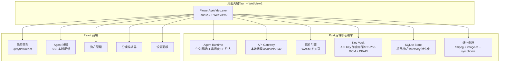
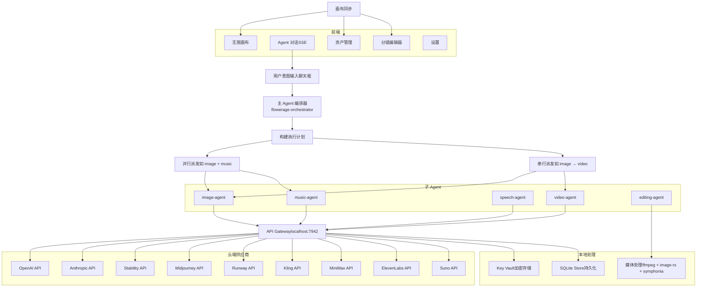
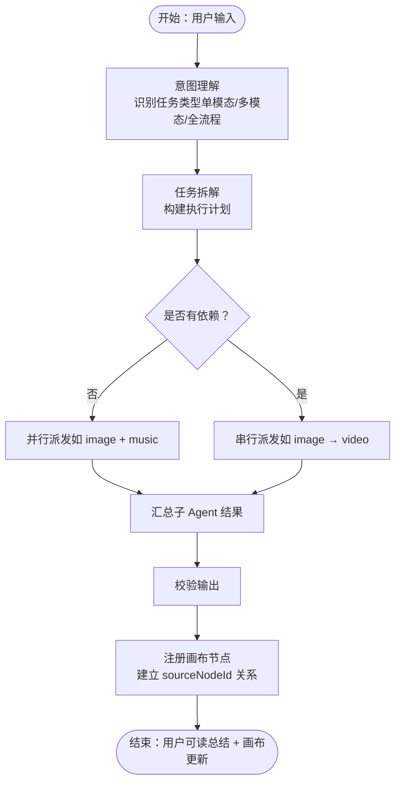
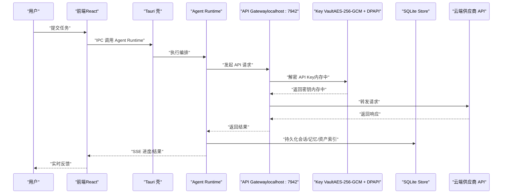
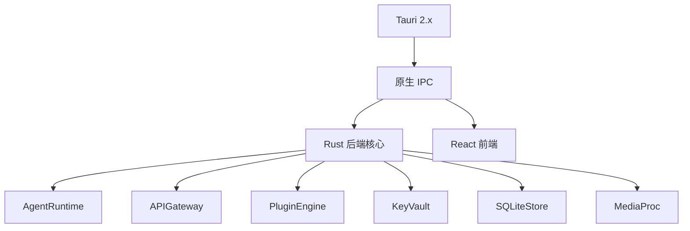

# 架构设计

<cite>
**本文引用的文件**
- [buzhidaozenmemingmin.md](file://buzhidaozenmemingmin.md)
</cite>

## 目录
1. [简介](#简介)
2. [项目结构](#项目结构)
3. [核心组件](#核心组件)
4. [架构总览](#架构总览)
5. [详细组件分析](#详细组件分析)
6. [依赖关系分析](#依赖关系分析)
7. [性能考量](#性能考量)
8. [故障排查指南](#故障排查指南)
9. [结论](#结论)
10. [附录](#附录)

## 简介
Flower Age Video 是一款基于 Tauri 框架的 AI 驱动无限画布创意工作站，面向视频创作者与内容生产者。项目采用三层架构：桌面壳层（Tauri + Rust + WebView2）、Rust 后端核心引擎（Agent Runtime + API Gateway + 插件引擎 + Key Vault + SQLite）、React 前端（无限画布 + Agent 对话 + 资产管理 + 分镜编辑 + 设置）。系统强调“零依赖、零代理、零侵权”，所有 AI 能力通过用户自有 API Key 直连云端供应商，本地仅负责编排与媒体处理。

## 项目结构
项目采用前后端分离但通过 Tauri IPC 紧密耦合的组织方式，核心目录如下：
- src-tauri：Rust 后端，包含 Agent 运行时、API 网关、插件引擎、Key Vault、存储、画布后端、媒体处理等模块
- src：React 前端，包含无限画布、Agent 对话、资产管理、分镜编辑、设置、项目管理、UI 组件与工具函数
- 资源与知识库：resources 下的 agents、contracts、knowledge 等模板与约束协议
- 配置：tauri.conf.json、Cargo.toml、package.json、vite.config.ts 等



图表来源
- [buzhidaozenmemingmin.md:27-50](file://buzhidaozenmemingmin.md#L27-L50)
- [buzhidaozenmemingmin.md:355-472](file://buzhidaozenmemingmin.md#L355-L472)

章节来源
- [buzhidaozenmemingmin.md:27-50](file://buzhidaozenmemingmin.md#L27-L50)
- [buzhidaozenmemingmin.md:355-472](file://buzhidaozenmemingmin.md#L355-L472)

## 核心组件
- Tauri 桌面壳层：提供窗口容器、系统托盘、自动更新、原生 IPC，承载 Rust 后端与 React 前端
- Agent Runtime：主/子 Agent 生命周期管理、工具调度、系统提示词注入、步数预算控制
- API Gateway：统一本地代理，将请求路由至各云端供应商 API，不存储或转发用户密钥
- 插件引擎：基于 wasmtime 的 WASM 插件热加载，扩展新 AI 模型接入
- Key Vault：API Key 本地加密存储（AES-256-GCM），结合 Windows DPAPI，密文存于 SQLite
- SQLite Store：项目数据、资产索引、Memory、会话历史等持久化
- 媒体处理：ffmpeg-sidecar、image-rs、symphonia 等，负责视频合并、转场、音频混音、图像编解码
- 无限画布：基于 @xyflow/react 的 React Flow 无限画布，支持节点拖拽、连线、分组、小地图
- Agent 对话：React + SSE，实时展示主 Agent 的思考与进度
- 资产管理：浏览与管理生成的图片/视频/音频/文本/分镜等资产
- 分镜编辑器：镜头编号、描述、时长、转场等编辑
- 设置：模型/API/偏好设置，API Key 管理

章节来源
- [buzhidaozenmemingmin.md:52-65](file://buzhidaozenmemingmin.md#L52-L65)
- [buzhidaozenmemingmin.md:87-134](file://buzhidaozenmemingmin.md#L87-L134)

## 架构总览
系统以 Tauri 为壳，Rust 后端提供高性能、安全、可扩展的核心能力；React 前端提供直观的可视化工作流。Agent 编排驱动多子 Agent 并行/串行执行，最终将产物注册到无限画布，形成“意图 → 编排 → 执行 → 可视化”的完整闭环。



图表来源
- [buzhidaozenmemingmin.md:66-83](file://buzhidaozenmemingmin.md#L66-L83)
- [buzhidaozenmemingmin.md:268-288](file://buzhidaozenmemingmin.md#L268-L288)
- [buzhidaozenmemingmin.md:355-472](file://buzhidaozenmemingmin.md#L355-L472)

## 详细组件分析

### Agent 体系与编排流程
- 分层架构：主 Agent（orchestrator）负责意图理解、任务拆解、派发与汇总；子 Agent 各司其职（图像/视频/语音/音乐/后期）
- 步数预算：主 Agent 400 步，子 Agent 各 200 步，防止无限推理
- 编排流程：Stage 1 意图理解 → Stage 2 并行/串行派发 → Stage 3 校验与画布同步
- 系统提示词（SP）：角色定义、工具 SOP、降级矩阵、输出格式、安全红线、步数提醒，模板化管理在 resources/agents/



图表来源
- [buzhidaozenmemingmin.md:172-190](file://buzhidaozenmemingmin.md#L172-L190)
- [buzhidaozenmemingmin.md:161-171](file://buzhidaozenmemingmin.md#L161-L171)

章节来源
- [buzhidaozenmemingmin.md:137-210](file://buzhidaozenmemingmin.md#L137-L210)

### API 网关与 Key Vault
- API Gateway：本地监听（localhost:7942），统一路由到各供应商 API，不存储或转发用户密钥
- Key Vault：API Key 使用 AES-256-GCM 加密，密钥由 Windows DPAPI 保护，密文存于 SQLite；解密仅在调用时于内存中短暂停留，严格避免明文落盘与日志
- 供应商支持：首批覆盖主流 LLM、图像、视频、语音、音乐供应商，后续可通过插件引擎扩展



图表来源
- [buzhidaozenmemingmin.md:268-288](file://buzhidaozenmemingmin.md#L268-L288)
- [buzhidaozenmemingmin.md:338-350](file://buzhidaozenmemingmin.md#L338-L350)

章节来源
- [buzhidaozenmemingmin.md:266-350](file://buzhidaozenmemingmin.md#L266-L350)

### 无限画布与节点系统
- 画布核心：基于 @xyflow/react（React Flow），支持无限缩放、拖拽、连线、分组、小地图、对齐吸附
- 节点类型：ProjectNode、TextNode、ImageNode、VideoNode、AudioNode、StoryboardNode、TaskNode、GroupNode
- 状态管理：Zustand 管理节点、边、视口、项目上下文、Agent 任务映射与同步

```mermaid
classDiagram
class CanvasState {
+nodes : Node[]
+edges : Edge[]
+viewport : {x, y, zoom}
+currentProjectId : string
+agentTaskMap : Map<string, string>
+addNode(node)
+removeNode(id)
+connectNodes(source, target)
+syncAgentResult(taskId, result)
}
class Node {
+id : string
+type : string
+position : {x, y}
+data : any
}
class Edge {
+id : string
+source : string
+target : string
}
CanvasState --> Node : "管理"
CanvasState --> Edge : "管理"
```

图表来源
- [buzhidaozenmemingmin.md:239-262](file://buzhidaozenmemingmin.md#L239-L262)

章节来源
- [buzhidaozenmemingmin.md:213-262](file://buzhidaozenmemingmin.md#L213-L262)

### 插件引擎与扩展性
- 插件系统：基于 wasmtime 的 WASM 插件热加载，支持扩展新的 AI 模型接入与自定义工具
- 安全性：WASM 在沙箱内运行，相比 Python/Cython 更安全
- 集成模式：通过 MCP 风格工具注册表对接 Agent Runtime，实现统一工具调度

章节来源
- [buzhidaozenmemingmin.md:59-60](file://buzhidaozenmemingmin.md#L59-L60)
- [buzhidaozenmemingmin.md:114-124](file://buzhidaozenmemingmin.md#L114-L124)

### 媒体处理与后期流水线
- 媒体处理：ffmpeg-sidecar 负责视频合并、转场、音频混音、格式转换；image-rs/symphonia 提供高性能图像/音频处理
- 后期流水线：editing-agent 负责片段合并、转场、唇形同步、BGM 混音、MV 流水线，输出 MP4/MOV/AVI 等格式
- 质量校验：流校验 Δ ≤ 0.08s，确保时序精度

章节来源
- [buzhidaozenmemingmin.md:64-65](file://buzhidaozenmemingmin.md#L64-L65)
- [buzhidaozenmemingmin.md:130-133](file://buzhidaozenmemingmin.md#L130-L133)
- [buzhidaozenmemingmin.md:674-680](file://buzhidaozenmemingmin.md#L674-L680)

## 依赖关系分析
- 技术栈许可证：全部依赖 MIT/Apache-2.0/BSD 许可证，无 GPL 传染风险，可安全商用
- 与参考项目差异：采用 Tauri 替代 Electron、Rust 替代 Node.js/Python、用户自有 API Key 替代 Cloud Gateway、WASM 插件替代 Python Cython
- 组件耦合：Tauri 壳作为统一入口，Rust 后端提供高内聚能力，React 前端通过 IPC 与后端解耦



图表来源
- [buzhidaozenmemingmin.md:87-134](file://buzhidaozenmemingmin.md#L87-L134)
- [buzhidaozenmemingmin.md:694-709](file://buzhidaozenmemingmin.md#L694-L709)

章节来源
- [buzhidaozenmemingmin.md:596-621](file://buzhidaozenmemingmin.md#L596-L621)
- [buzhidaozenmemingmin.md:694-709](file://buzhidaozenmemingmin.md#L694-L709)

## 性能考量
- 轻量壳层：Tauri 相比 Electron 体积减少约 90%，启动更快、内存占用更低
- 异步运行时：Rust 异步标准（tokio）+ 高性能 HTTP 框架（axum），适合高并发 API 调用
- 本地处理：媒体处理与图像/音频编解码在本地完成，减少网络往返
- 插件沙箱：WASM 插件在隔离环境中运行，避免全局状态污染
- 前端优化：Vite 极速 HMR、Zustand 轻量状态管理、Tailwind 原子化样式

## 故障排查指南
- API Key 问题：确认 Key Vault 加密存储正常，解密仅在调用时内存中短暂停留；检查 SQLite 中的密文是否正确
- 网络与代理：API Gateway 仅本地监听，确保未被防火墙拦截；检查供应商端点可达性
- 媒体处理：首次启动时 ffmpeg 自动下载，若失败检查网络与缓存目录权限
- 画布同步：确认 Agent Runtime 已将结果注册为画布节点，并建立 sourceNodeId 关系
- 日志与诊断：查看 %LOCALAPPDATA%\FlowerAgeVideo\logs 目录下的运行日志

章节来源
- [buzhidaozenmemingmin.md:500-509](file://buzhidaozenmemingmin.md#L500-L509)
- [buzhidaozenmemingmin.md:547-545](file://buzhidaozenmemingmin.md#L547-L545)

## 结论
Flower Age Video 通过 Tauri + Rust + React 的组合，实现了“轻量壳层 + 高性能后端 + 直观前端”的三层架构。主/子 Agent 编排模式确保复杂任务的确定性执行，API Gateway 与 Key Vault 保障隐私与安全，无限画布与媒体处理提供完整的创作闭环。项目在技术选型上追求极致的性能、安全与可扩展性，同时保持 100% 开源许可合规。

## 附录
- 安装与运行：零 Docker、零环境依赖，双击 exe 即可使用
- 许可证合规：全部依赖 MIT/Apache-2.0/BSD 许可证，无 GPL 传染风险
- 开发路线图：按阶段推进，涵盖核心框架、Agent 运行时、API 网关、画布增强、后期制作、打包发布

章节来源
- [buzhidaozenmemingmin.md:476-509](file://buzhidaozenmemingmin.md#L476-L509)
- [buzhidaozenmemingmin.md:596-621](file://buzhidaozenmemingmin.md#L596-L621)
- [buzhidaozenmemingmin.md:635-691](file://buzhidaozenmemingmin.md#L635-L691)