# 组件交互关系

<cite>
**本文档引用的文件**
- [buzhidaozenmemingmin.md](file://buzhidaozenmemingmin.md)
</cite>

## 目录
1. [简介](#简介)
2. [项目结构概览](#项目结构概览)
3. [核心组件架构](#核心组件架构)
4. [Agent Runtime 与 API Gateway 交互](#agent-runtime-与-api-gateway-交互)
5. [API Gateway 与 AI 供应商通信](#api-gateway-与-ai-供应商通信)
6. [Key Vault 与 Agent Runtime 协作](#key-vault-与-agent-runtime-协作)
7. [前端组件与后端 IPC 通信](#前端组件与后端-ipc-通信)
8. [无限画布与 Agent 系统同步](#无限画布与-agent-系统同步)
9. [数据流图](#数据流图)
10. [交互序列图](#交互序列图)
11. [依赖关系分析](#依赖关系分析)
12. [性能考虑](#性能考虑)
13. [故障排除指南](#故障排除指南)
14. [结论](#结论)

## 简介

Flower Age Video（花纪视频工作室）是一个基于 AI 驱动的无限画布创意工作站，面向视频创作者、内容生产者和 AI 艺术家。该项目采用主 Agent 编排 + 子 Agent 执行的核心架构模式，在本地 Windows 桌面上提供一个无限画布，用户通过主 Agent 描述创作意图，由多个专业子 Agent 自动完成图像生成、视频生成、语音合成、音乐生成和后期制作的全链路协作。

该系统的核心价值在于提供零商业侵权、本地部署、云端 AI 和无限画布四大特性，同时确保用户 API Key 的本地加密存储和无第三方代理的隐私保护。

## 项目结构概览

Flower Age Video 采用分层架构设计，主要分为以下层次：

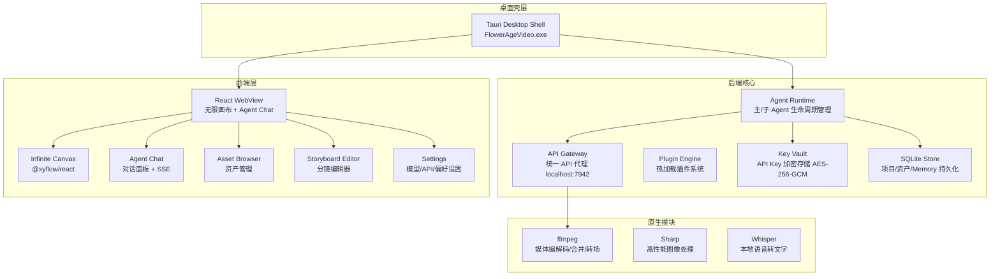

**图表来源**
- [buzhidaozenmemingmin.md:29-50](file://buzhidaozenmemingmin.md#L29-L50)

**章节来源**
- [buzhidaozenmemingmin.md:27-65](file://buzhidaozenmemingmin.md#L27-L65)

## 核心组件架构

### Agent 体系架构

Flower Age Video 采用分层的 Agent 架构，包含一个主 Agent 和五个专业子 Agent：

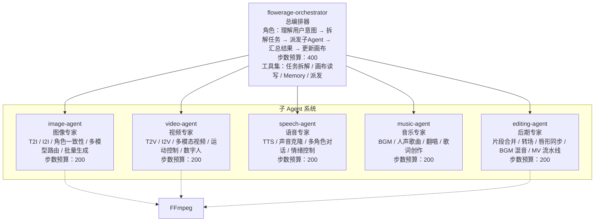

**图表来源**
- [buzhidaozenmemingmin.md:141-159](file://buzhidaozenmemingmin.md#L141-L159)

### 无限画布设计

无限画布基于 @xyflow/react (React Flow) 构建，支持无限缩放、拖拽布局、连线关系和分组节点等功能：

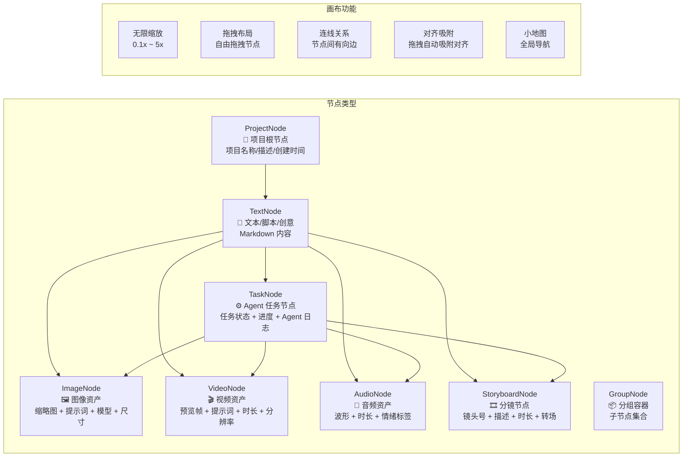

**图表来源**
- [buzhidaozenmemingmin.md:226-238](file://buzhidaozenmemingmin.md#L226-L238)

**章节来源**
- [buzhidaozenmemingmin.md:137-210](file://buzhidaozenmemingmin.md#L137-L210)

## Agent Runtime 与 API Gateway 交互

### 任务派发流程

Agent Runtime 作为系统的中央协调器，负责将用户意图分解为具体的子任务，并通过 API Gateway 将这些任务路由到相应的 AI 供应商：

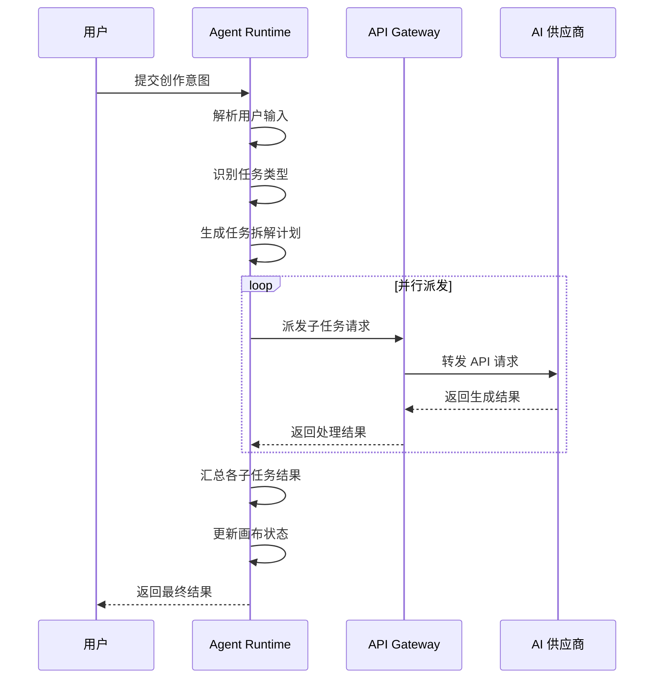

**图表来源**
- [buzhidaozenmemingmin.md:172-190](file://buzhidaozenmemingmin.md#L172-L190)

### 状态查询机制

API Gateway 提供统一的状态查询接口，允许 Agent Runtime 查询任务执行状态和进度：

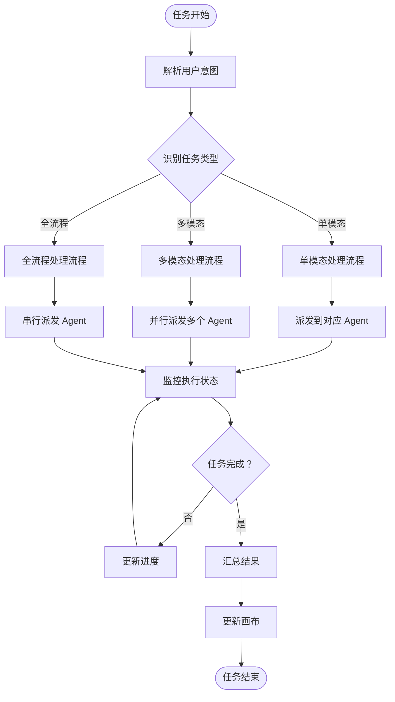

**图表来源**
- [buzhidaozenmemingmin.md:172-190](file://buzhidaozenmemingmin.md#L172-L190)

**章节来源**
- [buzhidaozenmemingmin.md:66-83](file://buzhidaozenmemingmin.md#L66-L83)

## API Gateway 与 AI 供应商通信

### 统一接口代理设计

API Gateway 作为统一的 API 代理层，负责将 Agent Runtime 的请求路由到不同的 AI 供应商，同时处理速率限制和错误处理：

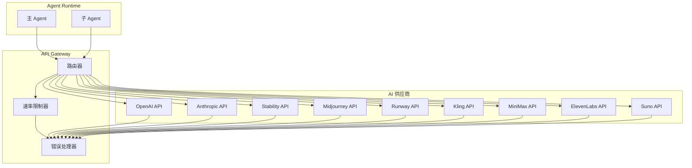

**图表来源**
- [buzhidaozenmemingmin.md:268-288](file://buzhidaozenmemingmin.md#L268-L288)

### 支持的 AI 供应商

系统支持多种主流 AI 供应商，涵盖大语言模型、图像生成、视频生成、语音合成和音乐生成等不同领域：

| 供应商类别 | 支持的供应商 | 主要模型 | 用途 |
|---|---|---|---|
| 大语言模型（LLM） | OpenAI、Anthropic、DeepSeek、通义千问、MiniMax | GPT-4o、Claude 4、DeepSeek-V3、Qwen-Max、MiniMax-Text-01 | 主力 Agent 推理、复杂创意推理、高性价比推理、中文优化、备用推理 |
| 图像生成 | OpenAI、Stability AI、Midjourney、即梦/豆包、Recraft | DALL·E 3、SD3、SDXL、Seedream、V3 | 通用图像、可控图像、艺术风格、中文文字渲染、矢量/设计 |
| 视频生成 | Runway、可灵、即梦、MiniMax、Luma | Gen-3、Kling 2.x、Seedance 2.0、Video-01、Dream Machine | 高质量 T2V、中文短视频、多模态视频、通用视频、氛围视频 |
| 语音合成 | MiniMax、ElevenLabs、OpenAI | speech-2.8-hd、Multilingual v2、TTS-1 | 中文多情绪 TTS、多语种 + 声音克隆、通用 TTS |
| 音乐生成 | Suno、Udio、MiniMax | V4、V2、music-2.6 | 带人声歌曲、高品质 BGM、器乐/翻唱 |

**章节来源**
- [buzhidaozenmemingmin.md:290-337](file://buzhidaozenmemingmin.md#L290-L337)

## Key Vault 与 Agent Runtime 协作

### API Key 加密存储架构

Key Vault 采用 AES-256-GCM 加密算法和 Windows DPAPI 保护机制，确保用户 API Key 的安全存储和使用：

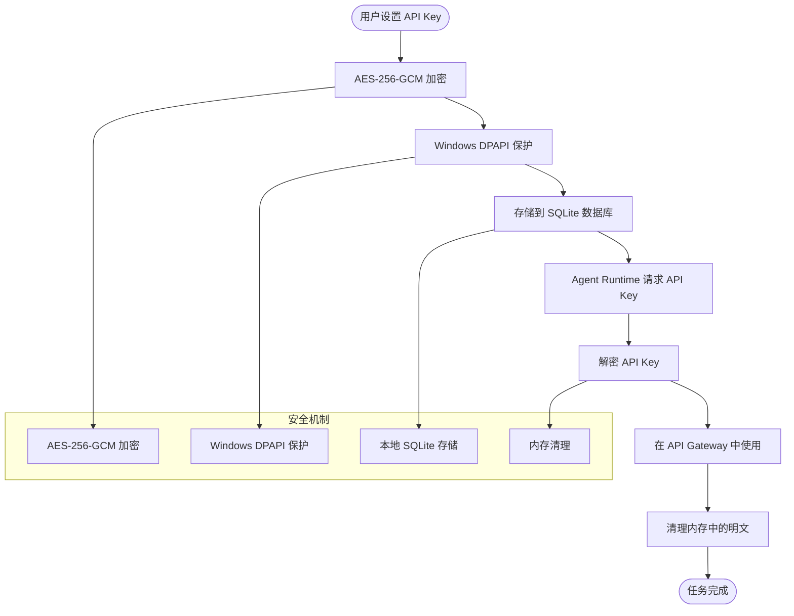

**图表来源**
- [buzhidaozenmemingmin.md:338-350](file://buzhidaozenmemingmin.md#L338-L350)

### Key Vault 安全设计要点

1. **API Key → AES-256-GCM 加密**：使用业界标准的对称加密算法确保数据机密性
2. **加密密钥 → Windows DPAPI 保护**：利用操作系统级别的密钥管理系统提供额外保护
3. **密文存储 → SQLite（本地）**：所有数据都存储在本地数据库中，无网络传输
4. **解密仅在 API 调用时，内存中短暂停留**：最小化明文暴露时间
5. **从不写入日志、不网络传输、不持久化明文**：确保数据完全本地化处理

**章节来源**
- [buzhidaozenmemingmin.md:338-350](file://buzhidaozenmemingmin.md#L338-L350)

## 前端组件与后端 IPC 通信

### Tauri IPC 通信架构

前端 React 应用通过 Tauri 的 IPC（Inter-Process Communication）机制与 Rust 后端进行通信，实现无缝的数据交换和功能调用：

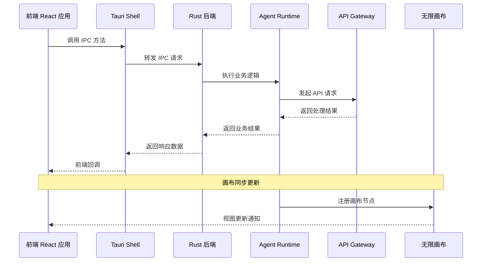

**图表来源**
- [buzhidaozenmemingmin.md:570-575](file://buzhidaozenmemingmin.md#L570-L575)

### 前端组件模块划分

前端应用采用模块化设计，包含多个专门的功能模块：

```mermaid
graph TB
subgraph "核心应用"
MainApp[App.tsx<br/>根组件]
MainEntry[main.tsx<br/>入口文件]
end
subgraph "画布模块"
CanvasMain[Canvas.tsx<br/>主画布组件]
CanvasStore[store.ts<br/>Zustand 状态管理]
CanvasHooks[hooks/<br/>画布 Hooks]
CanvasNodes[nodes/<br/>节点类型]
CanvasToolbar[toolbar/<br/>工具栏]
end
subgraph "对话模块"
ChatPanel[ChatPanel.tsx<br/>对话面板]
MessageBubble[MessageBubble.tsx<br/>消息气泡]
Thinking[AgentThinking.tsx<br/>思考过程展示]
Progress[ProgressBar.tsx<br/>任务进度条]
end
subgraph "资产管理"
AssetBrowser[AssetBrowser.tsx<br/>资产管理浏览器]
AssetCard[AssetCard.tsx<br/>资产卡片]
end
subgraph "分镜编辑器"
StoryboardEditor[StoryboardEditor.tsx<br/>分镜编辑器]
ShotCard[ShotCard.tsx<br/>镜头卡片]
Timeline[Timeline.tsx<br/>时间轴]
end
subgraph "设置模块"
SettingsPage[SettingsPage.tsx<br/>设置页面]
ApiKeyManager[ApiKeyManager.tsx<br/>API Key 管理]
ModelSelector[ModelSelector.tsx<br/>模型选择]
PreferencePanel[PreferencePanel.tsx<br/>偏好设置]
end
subgraph "工具函数"
TauriIPC[tauri.ts<br/>Tauri IPC 封装]
API[api.ts<br/>API 调用]
Utils[utils.ts<br/>工具函数]
end
MainApp --> CanvasMain
MainApp --> ChatPanel
MainApp --> AssetBrowser
MainApp --> StoryboardEditor
MainApp --> SettingsPage
CanvasMain --> CanvasStore
CanvasMain --> CanvasHooks
CanvasMain --> CanvasNodes
CanvasMain --> CanvasToolbar
ChatPanel --> MessageBubble
ChatPanel --> Thinking
ChatPanel --> Progress
SettingsPage --> ApiKeyManager
SettingsPage --> ModelSelector
SettingsPage --> PreferencePanel
MainApp --> TauriIPC
MainApp --> API
MainApp --> Utils
```

**图表来源**
- [buzhidaozenmemingmin.md:418-472](file://buzhidaozenmemingmin.md#L418-L472)

**章节来源**
- [buzhidaozenmemingmin.md:418-472](file://buzhidaozenmemingmin.md#L418-L472)

## 无限画布与 Agent 系统同步

### 画布同步协议

无限画布与 Agent 系统之间建立了完整的同步协议，确保所有生成的资产都能自动注册到画布节点中：

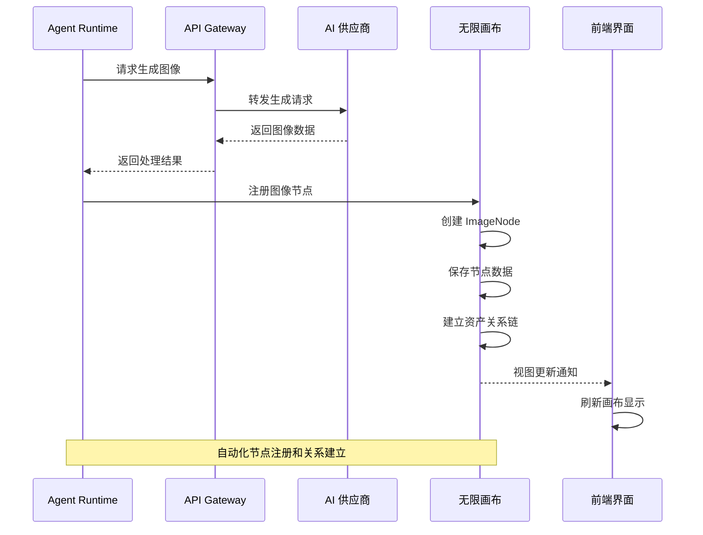

**图表来源**
- [buzhidaozenmemingmin.md:185-189](file://buzhidaozenmemingmin.md#L185-L189)

### 画布状态管理

Zustand 状态管理提供了完整的画布状态维护机制，包括节点操作、连线关系和 Agent 集成：

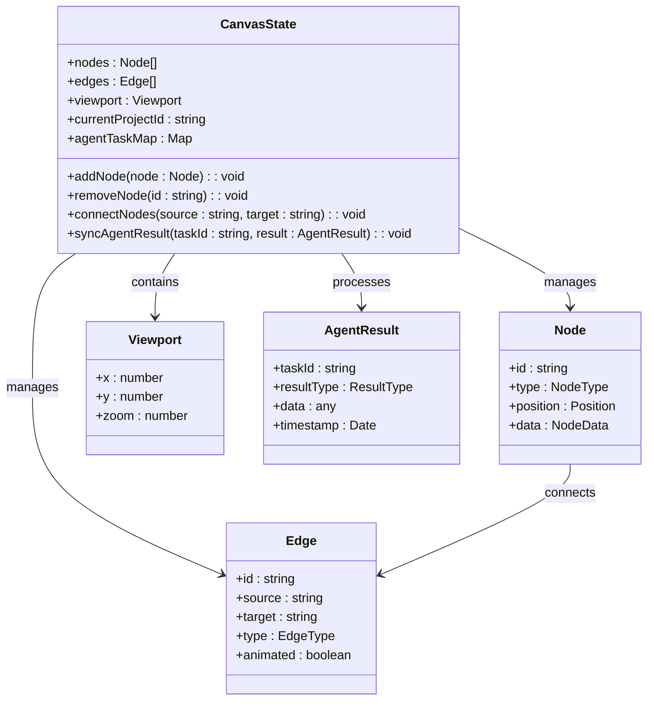

**图表来源**
- [buzhidaozenmemingmin.md:239-262](file://buzhidaozenmemingmin.md#L239-L262)

### 节点注册流程

当 Agent 完成任务执行后，系统会自动将结果注册到画布中，并建立相应的节点关系：

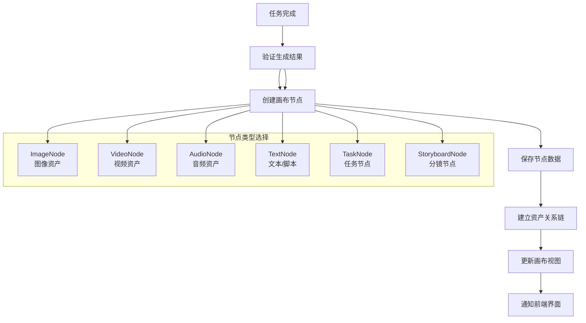

**图表来源**
- [buzhidaozenmemingmin.md:185-189](file://buzhidaozenmemingmin.md#L185-L189)

**章节来源**
- [buzhidaozenmemingmin.md:213-262](file://buzhidaozenmemingmin.md#L213-L262)

## 数据流图

### 系统整体数据流

Flower Age Video 系统的数据流涵盖了从用户输入到最终输出的完整生命周期：

```mermaid
graph TB
subgraph "外部输入"
UserInput[用户输入意图<br/>Chat]
APIKeys[用户 API Key<br/>配置]
end
subgraph "Agent 系统"
Orchestrator[主 Agent<br/>flowerage-orchestrator]
ImageAgent[image-agent]
VideoAgent[video-agent]
SpeechAgent[speech-agent]
MusicAgent[music-agent]
EditingAgent[editing-agent]
end
subgraph "API 层"
APIService[API Gateway<br/>localhost:7942]
Providers[AI 供应商 API]
end
subgraph "存储层"
KeyVault[Key Vault<br/>AES-256-GCM + DPAPI]
SQLiteDB[SQLite 数据库<br/>flowerage.db]
end
subgraph "画布层"
InfiniteCanvas[无限画布<br/>@xyflow/react]
NodeStore[节点存储<br/>JSON]
EdgeStore[连线存储]
end
subgraph "前端层"
ReactUI[React WebView]
ChatPanel[Agent Chat<br/>SSE 进度]
AssetBrowser[Asset Browser]
end
UserInput --> Orchestrator
APIKeys --> KeyVault
KeyVault --> APIService
Orchestrator --> ImageAgent
Orchestrator --> VideoAgent
Orchestrator --> SpeechAgent
Orchestrator --> MusicAgent
Orchestrator --> EditingAgent
ImageAgent --> APIService
VideoAgent --> APIService
SpeechAgent --> APIService
MusicAgent --> APIService
EditingAgent --> APIService
APIService --> Providers
Providers --> APIService
APIService --> Orchestrator
Orchestrator --> InfiniteCanvas
Orchestrator --> SQLiteDB
InfiniteCanvas --> NodeStore
InfiniteCanvas --> EdgeStore
NodeStore --> SQLiteDB
EdgeStore --> SQLiteDB
ReactUI --> ChatPanel
ReactUI --> AssetBrowser
ChatPanel --> Orchestrator
AssetBrowser --> SQLiteDB
```

**图表来源**
- [buzhidaozenmemingmin.md:66-83](file://buzhidaozenmemingmin.md#L66-L83)

### 数据持久化流程

系统采用分层的数据持久化策略，确保数据的安全性和一致性：

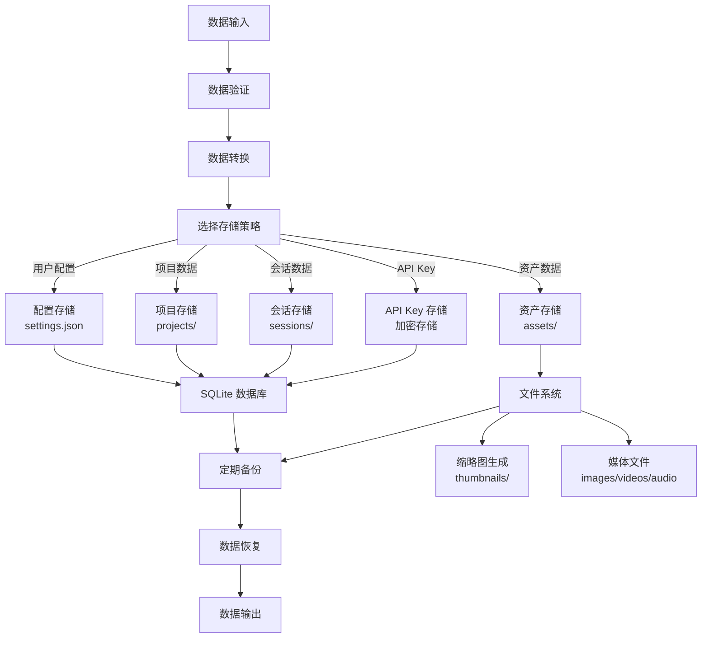

**图表来源**
- [buzhidaozenmemingmin.md:512-545](file://buzhidaozenmemingmin.md#L512-L545)

**章节来源**
- [buzhidaozenmemingmin.md:512-545](file://buzhidaozenmemingmin.md#L512-L545)

## 交互序列图

### 完整创作工作流

以下序列图展示了从用户提交创作意图到最终获得结果的完整交互流程：

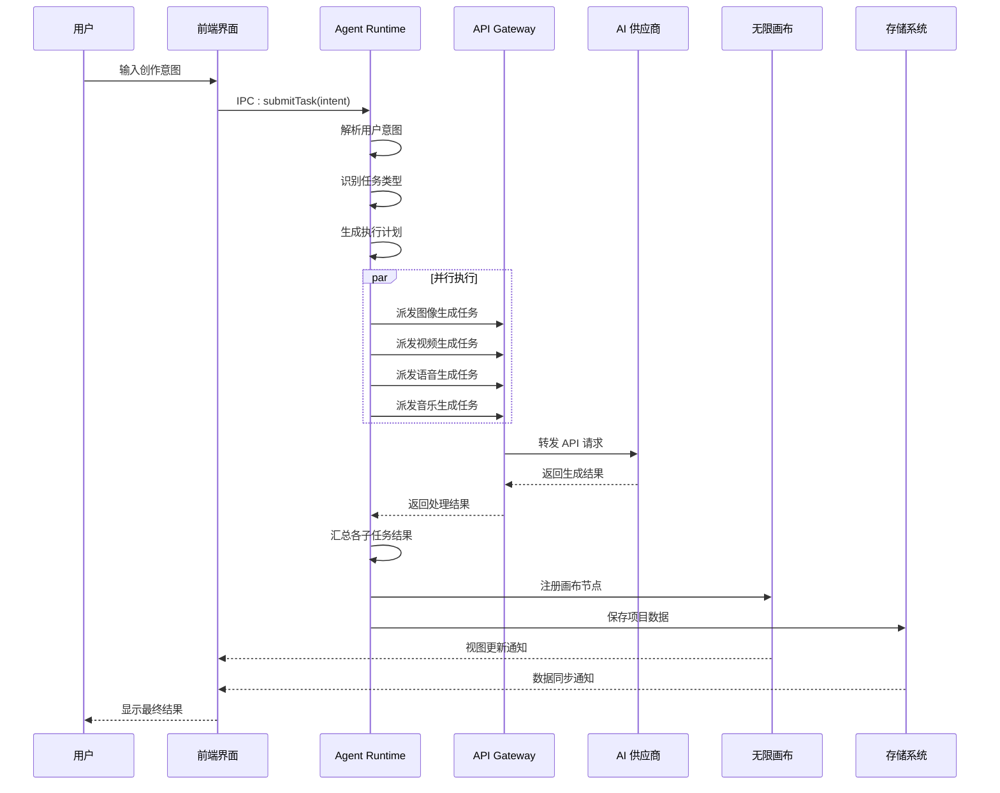

**图表来源**
- [buzhidaozenmemingmin.md:66-83](file://buzhidaozenmemingmin.md#L66-L83)

### API Key 获取流程

API Key 的获取和使用遵循严格的安全流程，确保数据的机密性和完整性：

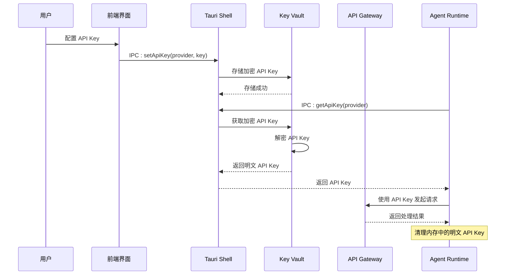

**图表来源**
- [buzhidaozenmemingmin.md:338-350](file://buzhidaozenmemingmin.md#L338-L350)

### 画布节点同步流程

画布节点的自动同步确保了所有生成的资产都能正确地在画布中显示和管理：

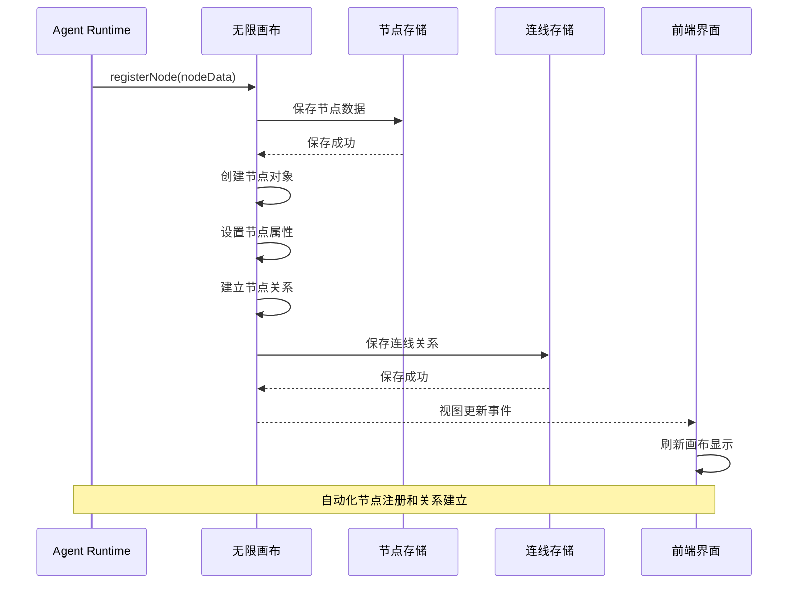

**图表来源**
- [buzhidaozenmemingmin.md:185-189](file://buzhidaozenmemingmin.md#L185-L189)

## 依赖关系分析

### 技术栈依赖关系

Flower Age Video 采用 MIT/Apache-2.0/BSD 许可证的技术栈，确保了项目的开源合规性和商业可用性：

```mermaid
graph TB
subgraph "桌面框架"
Tauri[Tauri 2.x<br/>MIT + Apache-2.0]
WebView2[WebView2<br/>系统组件]
Bundler[Tauri Bundler<br/>MIT]
Updater[Tauri Updater<br/>MIT]
end
subgraph "前端技术"
React[React 18<br/>MIT]
TypeScript[TypeScript 5.x<br/>Apache-2.0]
Vite[Vite<br/>MIT]
XYFlow[@xyflow/react<br/>MIT]
Zustand[Zustand<br/>MIT]
ShadcnUI[shadcn/ui + Radix<br/>MIT]
Tailwind[Tailwind CSS<br/>MIT]
Motion[Framer Motion<br/>MIT]
AISDK[@ai-sdk/react<br/>Apache-2.0]
end
subgraph "后端技术"
Axum[Axum<br/>MIT]
Tokio[Tokio<br/>MIT]
Serde[Serde / Serde_json<br/>MIT + Apache-2.0]
Reqwest[Reqwest<br/>MIT + Apache-2.0]
Ring[Ring + AEAD<br/>ISC (BSD-like)]
Rusqlite[Rusqlite<br/>MIT]
Tera[Tera<br/>MIT]
SSE[tokio-stream<br/>MIT]
Wasmtime[Wasmtime<br/>Apache-2.0]
end
subgraph "原生模块"
FFmpeg[ffmpeg-sidecar<br/>MIT]
ImageRS[image-rs<br/>MIT]
Symphonia[Symphonia<br/>MPL-2.0]
Whisper[whisper-rs<br/>MIT]
end
Tauri --> React
React --> AXum
AXum --> Ring
Ring --> Rusqlite
FFmpeg --> ImageRS
Symphonia --> Whisper
```

**图表来源**
- [buzhidaozenmemingmin.md:87-134](file://buzhidaozenmemingmin.md#L87-L134)

### 组件耦合度分析

系统采用了合理的分层架构，降低了组件间的耦合度：

| 组件层级 | 耦合度 | 说明 | 优化建议 |
|---|---|---|---|
| 桌面壳层 | 低 | 仅负责窗口容器和 IPC | 保持独立，避免业务逻辑侵入 |
| Agent Runtime | 中 | 与 API Gateway、Key Vault 紧密耦合 | 通过抽象接口降低耦合 |
| API Gateway | 中 | 与多个 AI 供应商耦合 | 通过适配器模式解耦 |
| 无限画布 | 低 | 与后端通过 IPC 通信 | 保持松耦合，便于替换 |
| 存储系统 | 低 | 通过统一接口访问 | 使用仓储模式抽象 |

**章节来源**
- [buzhidaozenmemingmin.md:87-134](file://buzhidaozenmemingmin.md#L87-L134)

## 性能考虑

### 并行处理优化

系统通过并行处理多个子 Agent 来提高整体性能：

- **并行派发**：无依赖的 Agent 可以同时执行，如图像生成和音乐生成可以并行进行
- **串行依赖**：有依赖关系的 Agent 按顺序执行，如图像生成完成后才能进行视频生成
- **资源隔离**：每个 Agent 在独立的执行环境中运行，避免相互影响

### 缓存策略

- **API Key 缓存**：在内存中短期缓存解密后的 API Key，减少重复解密开销
- **画布节点缓存**：对常用的节点类型和样式进行缓存，提高渲染性能
- **媒体文件缓存**：对生成的媒体文件进行缓存，支持快速重用

### 内存管理

- **及时清理**：API Key 和中间结果在使用后立即清理，避免内存泄漏
- **批量处理**：对大量数据的处理采用流式处理，减少内存占用
- **垃圾回收**：合理设置垃圾回收策略，平衡性能和内存使用

## 故障排除指南

### 常见问题诊断

1. **API Key 无效**
   - 检查 API Key 是否正确配置
   - 验证网络连接是否正常
   - 查看 API 供应商的配额限制

2. **Agent 执行失败**
   - 检查 Agent 的步数预算设置
   - 验证输入参数的格式和范围
   - 查看错误日志获取详细信息

3. **画布节点缺失**
   - 确认画布同步功能是否启用
   - 检查节点注册是否成功
   - 验证画布视图刷新机制

### 日志分析

系统提供了多层次的日志记录机制：

- **前端日志**：React 应用的错误和调试信息
- **后端日志**：Rust 后端的详细执行日志
- **API 日志**：所有 API 调用的请求和响应记录
- **画布日志**：画布操作和状态变更记录

### 性能监控

- **执行时间监控**：跟踪各 Agent 的执行时间和资源消耗
- **内存使用监控**：监控内存使用情况，及时发现内存泄漏
- **网络请求监控**：统计 API 调用次数和成功率

## 结论

Flower Age Video 项目通过精心设计的组件交互关系，实现了高效、安全、易用的 AI 创意工作流。系统的核心优势体现在以下几个方面：

1. **架构清晰**：采用分层架构，职责明确，易于维护和扩展
2. **安全可靠**：API Key 本地加密存储，无第三方代理，确保用户隐私
3. **性能优异**：并行处理多个子 Agent，充分利用系统资源
4. **用户体验**：无限画布提供直观的创作体验，实时进度反馈
5. **开源合规**：100% MIT/Apache-2.0 许可证，无 GPL 传染风险

通过本文档的详细分析，开发者可以更好地理解系统的组件交互模式和数据流向，为后续的开发和维护工作提供指导。系统的模块化设计和清晰的接口定义，使得添加新的 AI 供应商、扩展画布功能或优化性能都变得相对简单。