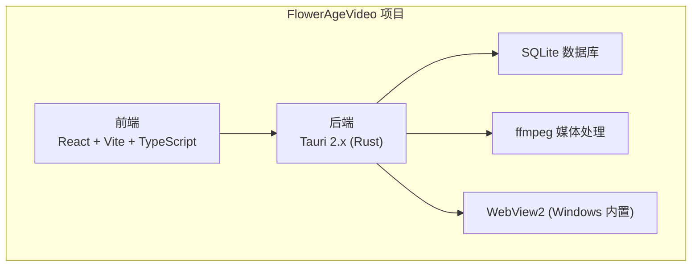
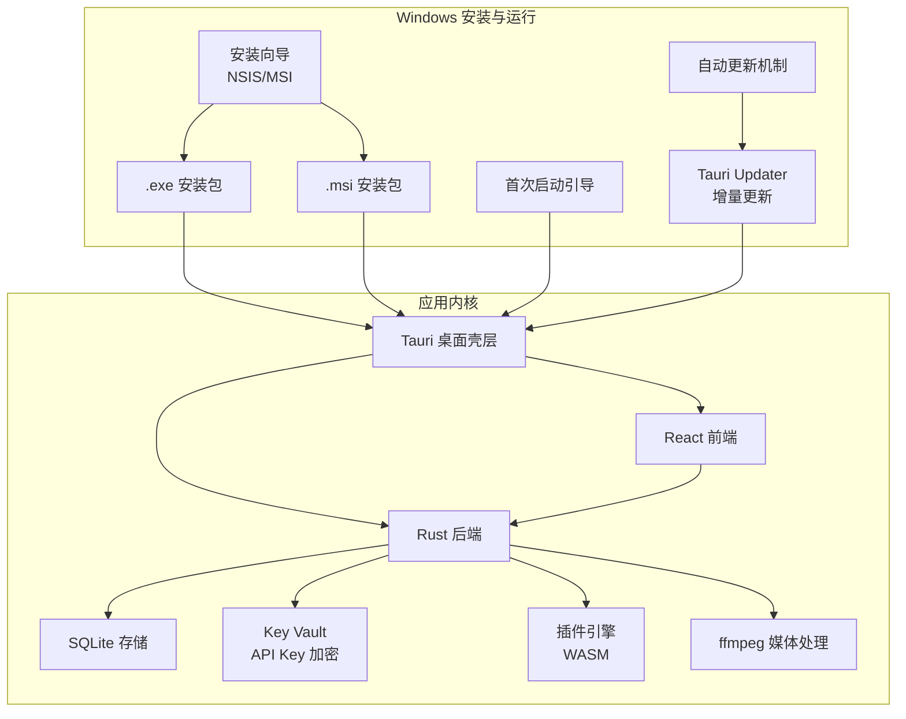
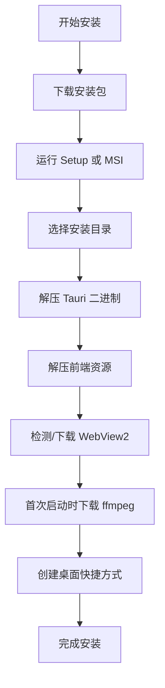
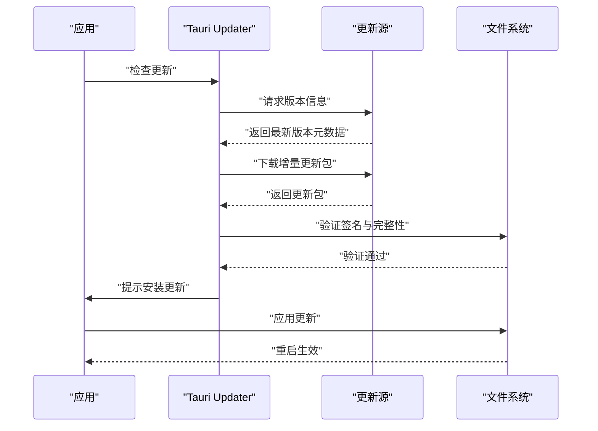
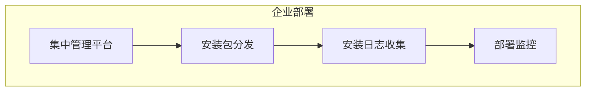
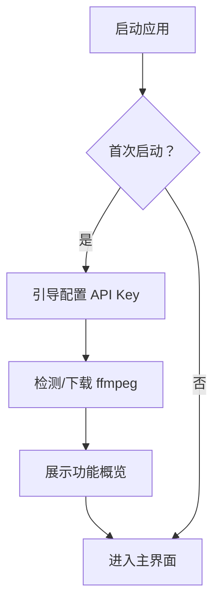
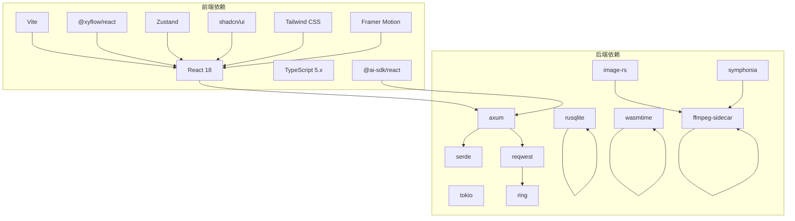

# 部署与发布

<cite>
**本文引用的文件**
- [buzhidaozenmemingmin.md](file://buzhidaozenmemingmin.md)
</cite>

## 目录
1. [简介](#简介)
2. [项目结构](#项目结构)
3. [核心组件](#核心组件)
4. [架构总览](#架构总览)
5. [详细组件分析](#详细组件分析)
6. [依赖分析](#依赖分析)
7. [性能考虑](#性能考虑)
8. [故障排查指南](#故障排查指南)
9. [结论](#结论)
10. [附录](#附录)

## 简介
本文件面向 Flower Age Video 在 Windows 平台的部署与发布，围绕 Tauri 2.x 桌面壳层，系统化阐述 .msi/.exe 安装包制作、自动更新机制、企业静默部署策略、安装向导设计与首次启动引导流程，并提供版本管理、回滚与故障恢复建议。文档同时给出部署架构图、发布流程图与自动化脚本示例，帮助团队在不同规模环境中稳定交付产品。

## 项目结构
根据现有文档，Flower Age Video 的工程组织分为前端与后端两部分，均位于同一仓库中：
- 前端：React + Vite + TypeScript，负责无限画布、对话交互、资产浏览、分镜编辑与设置面板。
- 后端：Rust（Tauri 2.x），负责 Agent 编排、API 网关、插件引擎、密钥保险库、SQLite 存储、媒体处理（ffmpeg）等。

**章节来源**
- [buzhidaozenmemingmin.md:354-472](file://buzhidaozenmemingmin.md#L354-L472)

## 核心组件
- Tauri 桌面壳层：提供窗口容器、系统托盘、自动更新、原生 IPC、打包与签名能力。
- Agent 运行时：主/子 Agent 生命周期管理、工具调度、SP 注入、步数限制与降级矩阵。
- API 网关：统一路由至各云端供应商 API，本地代理，不存储用户密钥明文。
- Key Vault：API Key 本地加密存储（AES-256-GCM + Windows DPAPI）。
- 插件引擎：WASM 动态加载，扩展新 AI 模型接入。
- 无限画布：@xyflow/react + Zustand，节点式画布，支持拖拽/缩放/连线/分组。
- 媒体处理：ffmpeg-sidecar，视频合并、转场、音频混音、格式转换。

**章节来源**
- [buzhidaozenmemingmin.md:27-65](file://buzhidaozenmemingmin.md#L27-L65)
- [buzhidaozenmemingmin.md:137-210](file://buzhidaozenmemingmin.md#L137-L210)
- [buzhidaozenmemingmin.md:266-350](file://buzhidaozenmemingmin.md#L266-L350)
- [buzhidaozenmemingmin.md:418-471](file://buzhidaozenmemingmin.md#L418-L471)

## 架构总览
下图展示了 Windows 平台部署的关键组件与交互关系，包括安装包生成、自动更新、首次启动引导与企业静默部署路径。

**图表来源**
- [buzhidaozenmemingmin.md:476-509](file://buzhidaozenmemingmin.md#L476-L509)
- [buzhidaozenmemingmin.md:90-97](file://buzhidaozenmemingmin.md#L90-L97)

**章节来源**
- [buzhidaozenmemingmin.md:476-509](file://buzhidaozenmemingmin.md#L476-L509)
- [buzhidaozenmemingmin.md:90-97](file://buzhidaozenmemingmin.md#L90-L97)

## 详细组件分析

### 安装包制作（.msi/.exe）
- 安装包形式与大小
  - Setup 可执行安装器：约 60MB，包含安装向导与必要资源。
  - MSI 安装包：约 58MB，适合企业静默部署。
- 安装流程
  - 选择安装目录（默认：%LOCALAPPDATA%\FlowerAgeVideo）。
  - 自动解压 Tauri 二进制、前端资源、检测/下载 WebView2、首次启动时下载 ffmpeg、创建桌面快捷方式。
- 运行时依赖
  - WebView2：Windows 10+ 内置，无需额外安装。
  - ffmpeg：首次启动时从 GitHub Releases 下载。
  - VC++ 运行时：系统自带。

**图表来源**
- [buzhidaozenmemingmin.md:485-498](file://buzhidaozenmemingmin.md#L485-L498)

**章节来源**
- [buzhidaozenmemingmin.md:476-509](file://buzhidaozenmemingmin.md#L476-L509)

### 自动更新机制
- 更新通道与触发
  - 使用 Tauri Updater，支持增量更新，无需额外服务器。
  - 更新检查可在应用启动时或后台定时触发。
- 更新包与签名
  - 更新包应与主程序同源，确保完整性与可信性。
  - 建议启用签名证书，防止篡改。
- 回滚策略
  - 保留上一版本备份，失败时自动回滚。
  - 提供手动回滚入口，便于人工干预。

**图表来源**
- [buzhidaozenmemingmin.md:90-97](file://buzhidaozenmemingmin.md#L90-L97)

**章节来源**
- [buzhidaozenmemingmin.md:90-97](file://buzhidaozenmemingmin.md#L90-L97)

### 企业静默部署与批量安装
- 静默参数
  - MSI 静默安装：支持命令行参数进行无人值守安装。
  - Setup 静默：可通过脚本调用，避免交互界面。
- 集中管理
  - 使用企业软件分发系统（如 SCCM、Intune、MDM）推送安装包。
  - 预先配置安装目录与首选项，减少终端用户操作。
- 批量策略
  - 制定安装清单与回执，确保覆盖率与一致性。
  - 对关键业务部门优先部署，逐步扩大范围。

**图表来源**
- [buzhidaozenmemingmin.md:482-484](file://buzhidaozenmemingmin.md#L482-L484)

**章节来源**
- [buzhidaozenmemingmin.md:482-484](file://buzhidaozenmemingmin.md#L482-L484)

### 安装向导设计与首次启动引导
- 安装向导
  - 选择安装目录、是否创建桌面快捷方式、是否随系统启动。
  - 显示运行时依赖检测结果与 WebView2 安装提示。
- 首次启动引导
  - 引导用户配置 API Key（本地加密存储）。
  - 提示下载 ffmpeg（可选跳过，后续按需下载）。
  - 展示功能概览与快速开始指引。

**图表来源**
- [buzhidaozenmemingmin.md:485-498](file://buzhidaozenmemingmin.md#L485-L498)

**章节来源**
- [buzhidaozenmemingmin.md:485-498](file://buzhidaozenmemingmin.md#L485-L498)

### 版本管理策略与回滚机制
- 版本命名
  - 采用语义化版本（主.次.修订），配合构建号形成唯一标识。
- 发布分支
  - develop → release/* → main；release/* 用于稳定发布与热修复。
- 回滚策略
  - 自动回滚：更新失败时自动回退至上一版本。
  - 手动回滚：提供“回滚至上一版本”按钮，记录回滚原因与时间。
- 故障恢复
  - 清理缓存与临时文件，重置关键配置。
  - 提供最小化配置启动选项，排除第三方影响。

**章节来源**
- [buzhidaozenmemingmin.md:682-691](file://buzhidaozenmemingmin.md#L682-L691)

### 自动化脚本示例（概念性）
以下为常见自动化场景的脚本思路（概念性，不含具体代码）：
- 安装包构建脚本
  - 调用 Tauri 打包命令，生成 .msi/.exe，附加签名。
- 企业静默部署脚本
  - 使用 MSI 参数进行无人值守安装，记录日志。
- 自动更新脚本
  - 定时检查更新，下载并应用增量更新包。
- 回滚脚本
  - 恢复备份版本，清理当前版本残留。

[本节为概念性说明，不直接分析具体文件]

## 依赖分析
- 框架与工具
  - Tauri 2.x（Rust）、WebView2（Windows 内置）、Tauri Bundler（生成 .msi/.exe）、Tauri Updater（增量更新）。
- 前端生态
  - React 18、TypeScript 5.x、Vite、@xyflow/react、Zustand、shadcn/ui、Tailwind CSS、Framer Motion、@ai-sdk/react。
- 后端生态
  - axum、tokio、serde、reqwest、ring、rusqlite、wasmtime、ffmpeg-sidecar、image-rs、symphonia。
- 原生模块
  - ffmpeg-sidecar（媒体处理）、image-rs（图像处理）、symphonia（音频解码）、whisper-rs（可选语音识别）。

**图表来源**
- [buzhidaozenmemingmin.md:87-134](file://buzhidaozenmemingmin.md#L87-L134)

**章节来源**
- [buzhidaozenmemingmin.md:87-134](file://buzhidaozenmemingmin.md#L87-L134)

## 性能考虑
- 安装包体积
  - 通过 Tauri 轻量化桌面壳层，相比 Electron 显著降低体积，提升安装与启动速度。
- 首次启动体验
  - 将 ffmpeg 下载延迟到首次启动，减少安装时间；提供可选跳过与后台下载策略。
- 运行时性能
  - Rust 后端 + WASM 插件，兼顾性能与安全性；SQLite 轻量存储满足本地需求。
- 更新效率
  - 增量更新减少带宽占用，缩短更新时间。

[本节为一般性指导，不直接分析具体文件]

## 故障排查指南
- 安装失败
  - 检查系统权限与磁盘空间；确认 WebView2 是否可用；查看安装日志。
- 启动异常
  - 清理 %LOCALAPPDATA%\FlowerAgeVideo\logs；重置 settings.json；重新下载 ffmpeg。
- 更新问题
  - 检查网络与代理；验证签名与完整性；回滚至上一版本。
- API Key 无法使用
  - 确认 Key 未被删除或损坏；检查 Key Vault 加密状态；重新配置。

**章节来源**
- [buzhidaozenmemingmin.md:512-546](file://buzhidaozenmemingmin.md#L512-L546)

## 结论
Flower Age Video 基于 Tauri 的 Windows 部署方案具备体积小、易安装、零环境依赖与强安全性的优势。通过规范化的 .msi/.exe 安装包制作、可靠的自动更新机制、完善的首次启动引导与企业静默部署策略，可在个人用户与企业环境中高效落地。建议结合语义化版本管理、回滚与故障恢复机制，持续优化发布流程与用户体验。

## 附录
- 最佳实践
  - 使用签名证书保障安装包与更新包的完整性与可信性。
  - 在企业环境中使用集中管理平台进行批量部署与监控。
  - 对关键版本建立灰度发布策略，逐步扩大覆盖面。
- 注意事项
  - 确保 WebView2 可用性与 ffmpeg 下载稳定性。
  - 严格遵循 API Key 加密存储与访问控制策略。
  - 定期评估第三方依赖的安全性与许可证合规性。