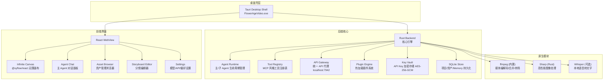
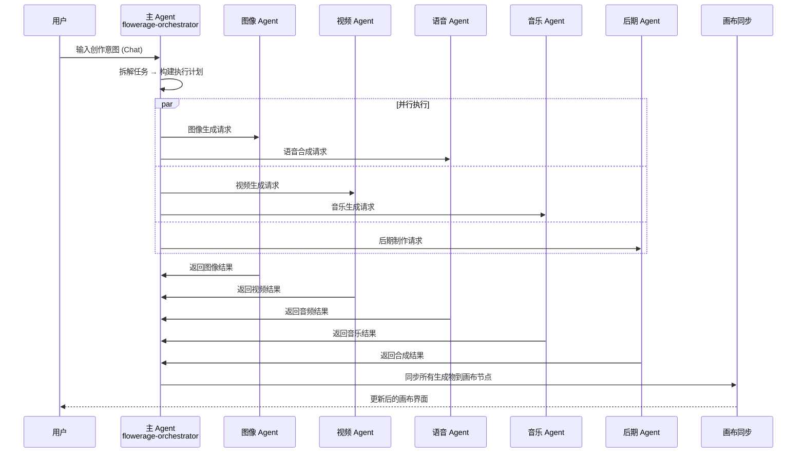
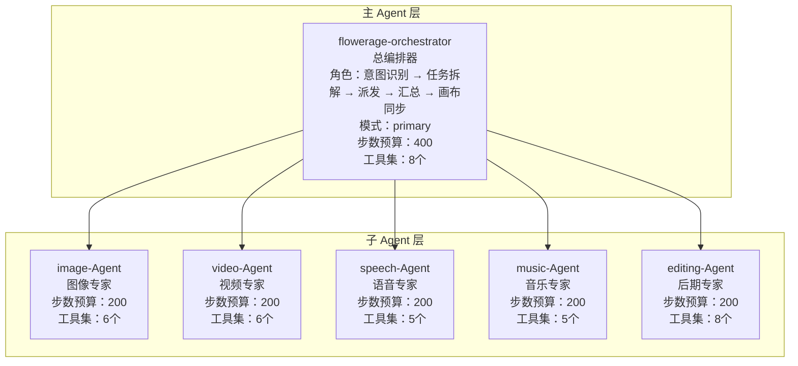
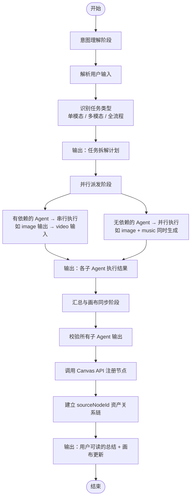
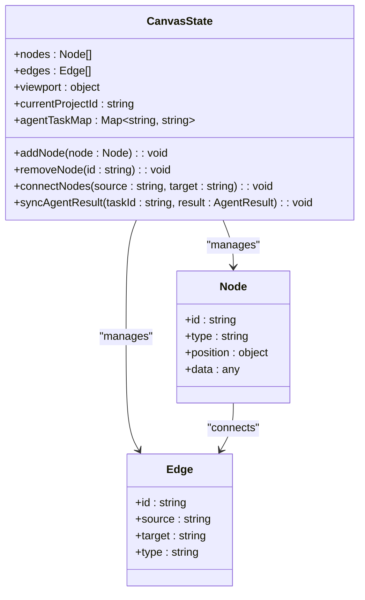
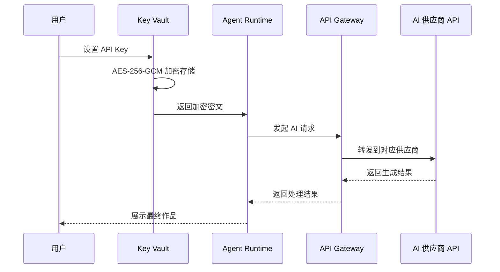
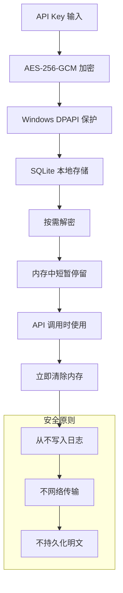
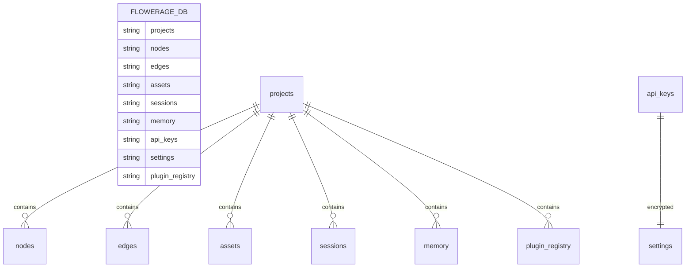

# 项目概述

<cite>
**本文档引用的文件**
- [buzhidaozenmemingmin.md](file://buzhidaozenmemingmin.md)
</cite>

## 目录
1. [项目简介](#项目简介)
2. [项目定位与价值主张](#项目定位与价值主张)
3. [技术架构概览](#技术架构概览)
4. [核心组件详解](#核心组件详解)
5. [Agent 体系设计](#agent-体系设计)
6. [无限画布系统](#无限画布系统)
7. [云端 AI 集成](#云端-ai-集成)
8. [本地部署方案](#本地部署方案)
9. [存储与数据管理](#存储与数据管理)
10. [技术选型与许可证](#技术选型与许可证)
11. [开发路线图](#开发路线图)
12. [总结](#总结)

## 项目简介

Flower Age Video（花纪视频工作室）是一个 AI 驱动的无限画布创意工作站，专为视频创作者、内容生产者和 AI 艺术家而设计。该项目采用创新的主 Agent 编排 + 子 Agent 执行架构模式，通过本地 Windows 桌面环境提供强大的创意工具集。

### 项目特色
- **AI 驱动的创意工作流**：通过智能 Agent 协作实现从概念到成品的全流程自动化
- **无限画布可视化管理**：支持所有媒体资产的可视化组织和管理
- **多模态内容生成**：涵盖图像、视频、语音、音乐等多种媒体类型的生成
- **本地隐私优先**：用户 API Key 本地加密存储，无第三方代理
- **零环境依赖**：单文件 .exe 安装，无需 Docker、Python 或 Node.js

## 项目定位与价值主张

### 核心定位
Flower Age Video 定位于为视频创作者提供一个完整的 AI 创意工作站，通过智能化的 Agent 协作系统，将复杂的媒体内容创作流程简化为直观的可视化操作。

### 价值主张矩阵

| 维度 | 说明 |
|------|------|
| **零商业侵权** | 全部依赖采用 MIT / Apache-2.0 / BSD 许可证，无 GPL 传染风险 |
| **本地部署** | 单文件 .exe 安装，无需 Docker、无需 Python 环境、无需 Node.js 运行时 |
| **云端 AI** | 用户配置自己的 API Key，本地加密存储，无第三方代理 |
| **无限画布** | 所有资产（图片/视频/音频/文本/分镜）在画布上可视化管理 |
| **主 Agent 控子 Agent** | 1 个编排器拆解任务 → 5 个专业子 Agent 并行/串行执行 |

### 目标用户群体
- **专业视频创作者**：需要高效内容生产的创意工作者
- **内容生产者**：企业营销团队和内容工作室
- **AI 艺术家**：探索 AI 创作可能性的艺术家
- **独立开发者**：寻求强大创作工具的个人创作者

## 技术架构概览

### 整体架构设计



**架构图来源**
- [buzhidaozenmemingmin.md:29-50](file://buzhidaozenmemingmin.md#L29-L50)

### 技术栈分布

| 层次 | 技术 | 作用 |
|------|------|------|
| **Tauri 壳** | Tauri 2.x (Rust) | 桌面窗口容器、系统托盘、自动更新、原生 IPC |
| **Agent Runtime** | Rust 异步运行时 | Agent 生命周期管理、工具调度、SP 注入、步数限制 |
| **API Gateway** | Rust (axum/hyper) | 本地 API 代理，路由到各 AI 供应商 API |
| **Plugin Engine** | Rust (动态加载) | 支持 `.wasm` 插件热加载，扩展新 AI 模型接入 |
| **Key Vault** | Rust (ring/aead) | API Key 本地加密存储，Windows DPAPI 加持 |
| **Infinite Canvas** | React + @xyflow/react | 节点式画布，拖拽/缩放/连线/分组 |
| **Agent Chat** | React + SSE | 实时 Agent 对话与进度反馈 |
| **SQLite** | tauri-plugin-sql | 项目数据、资产索引、Memory、会话历史 |
| **ffmpeg** | ffmpeg-sidecar (MIT) | 视频合并、转场、音频混音、格式转换 |

**章节来源**
- [buzhidaozenmemingmin.md:52-65](file://buzhidaozenmemingmin.md#L52-L65)

## 核心组件详解

### 请求链路流程



**图表来源**
- [buzhidaozenmemingmin.md:66-83](file://buzhidaozenmemingmin.md#L66-L83)

### 组件职责划分

| 组件 | 职责 | 关键特性 |
|------|------|----------|
| **主 Agent 编排器** | 理解用户意图 → 拆解任务 → 派发子 Agent → 汇总结果 → 更新画布 | 400 步数预算，8 个工具集 |
| **图像 Agent** | 文生图 / 图生图 / 角色一致性 / 多模型路由 / 批量生成 | 200 步数预算，6 个工具集 |
| **视频 Agent** | 文生视频 / 图生视频 / 多模态视频 / 运动控制 / 数字人 | 200 步数预算，6 个工具集 |
| **语音 Agent** | 文本转语音 / 声音克隆 / 多角色对话 / 情绪控制 | 200 步数预算，5 个工具集 |
| **音乐 Agent** | 背景音乐 / 人声歌曲 / 翻唱 / 歌词创作 | 200 步数预算，5 个工具集 |
| **后期 Agent** | 片段合并 / 转场 / 唇形同步 / BGM 混音 / MV 流水线 | 200 步数预算，8 个工具集 |

**章节来源**
- [buzhidaozenmemingmin.md:161-171](file://buzhidaozenmemingmin.md#L161-L171)

## Agent 体系设计

### 分层架构模式



**图表来源**
- [buzhidaozenmemingmin.md:139-159](file://buzhidaozenmemingmin.md#L139-L159)

### 主 Agent 编排流程



**图表来源**
- [buzhidaozenmemingmin.md:172-190](file://buzhidaozenmemingmin.md#L172-L190)

### Agent 系统提示词设计

每个 Agent 的系统提示词包含六个核心要素：

1. **角色定义 + 能力边界** - 明确 Agent 的职责范围
2. **工具使用 SOP** - 标准操作流程指南
3. **降级矩阵** - 失败兜底策略
4. **输出格式规范** - 统一的数据格式要求
5. **安全红线** - 不可覆盖的约束条件
6. **步数预算提醒** - 限制 Agent 的思考深度

- 主 Agent SP：约 500 行，核心是 Stage 决策表 + 派发规则
- 子 Agent SP：约 200 行/个，核心是模型路由 + 降级矩阵
- **总计**：约 1500 行 SP，模板化管理在 `resources/agents/` 下

**章节来源**
- [buzhidaozenmemingmin.md:192-210](file://buzhidaozenmemingmin.md#L192-L210)

## 无限画布系统

### 画布核心功能

基于 **@xyflow/react (React Flow)** 的无限画布系统，提供以下核心能力：

- **无限缩放**：支持 0.1x 至 5x 的缩放范围，通过鼠标滚轮实现
- **拖拽布局**：自由拖拽节点进行布局调整
- **连线关系**：节点间有向边，清晰表达资产依赖关系
- **分组节点**：Group Node 收纳相关资产，保持画布整洁
- **小地图**：MiniMap 全局导航，快速定位画布区域
- **对齐吸附**：拖拽时自动吸附对齐，提升布局效率

### 节点类型系统

| 节点类型 | 图标 | 功能 | 数据承载 |
|----------|------|------|----------|
| **ProjectNode** | 📁 | 项目根节点 | 项目名称/描述/创建时间 |
| **TextNode** | 📝 | 文本/脚本/创意 | Markdown 内容 |
| **ImageNode** | 🖼️ | 图像资产 | 缩略图 + 提示词 + 模型 + 尺寸 |
| **VideoNode** | 🎬 | 视频资产 | 预览帧 + 提示词 + 时长 + 分辨率 |
| **AudioNode** | 🎵 | 音频资产 | 波形 + 时长 + 情绪标签 |
| **StoryboardNode** | 🎞️ | 分镜节点 | 镜头号 + 描述 + 时长 + 转场 |
| **TaskNode** | ⚙️ | Agent 任务节点 | 任务状态 + 进度 + Agent 日志 |
| **GroupNode** | 📦 | 分组容器 | 子节点集合 |

### 画布状态管理



**图表来源**
- [buzhidaozenmemingmin.md:239-262](file://buzhidaozenmemingmin.md#L239-L262)

**章节来源**
- [buzhidaozenmemingmin.md:213-262](file://buzhidaozenmemingmin.md#L213-L262)

## 云端 AI 集成

### API Gateway 设计

用户在本地配置各供应商的 API Key，**不经过任何第三方服务器**：



**图表来源**
- [buzhidaozenmemingmin.md:268-288](file://buzhidaozenmemingmin.md#L268-L288)

### 支持的 AI 供应商

#### 大语言模型（LLM — 驱动 Agent 推理）

| 供应商 | 模型 | 用途 |
|--------|------|------|
| OpenAI | GPT-4o / GPT-4.1 | 主力 Agent 推理 |
| Anthropic | Claude 4 Sonnet / Opus | 复杂创意推理 |
| DeepSeek | DeepSeek-V3 / V4 | 高性价比推理 |
| 通义千问 | Qwen-Max | 中文优化 |
| MiniMax | MiniMax-Text-01 | 备用推理 |

#### 图像生成

| 供应商 | 模型 | 用途 |
|--------|------|------|
| OpenAI | DALL·E 3 | 通用图像 |
| Stability AI | SD3 / SDXL | 可控图像 |
| Midjourney | (第三方代理) | 艺术风格 |
| 即梦/豆包 | Seedream | 中文文字渲染 |
| Recraft | V3 | 矢量/设计 |

#### 视频生成

| 供应商 | 模型 | 用途 |
|--------|------|------|
| Runway | Gen-3 / Gen-4 | 高质量 T2V |
| 可灵 | Kling 2.x | 中文短视频 |
| 即梦 | Seedance 2.0 | 多模态视频 |
| MiniMax | Video-01 | 通用视频 |
| Luma | Dream Machine | 氛围视频 |

#### 语音合成

| 供应商 | 模型 | 用途 |
|--------|------|------|
| MiniMax | speech-2.8-hd | 中文多情绪 TTS |
| ElevenLabs | Multilingual v2 | 多语种 + 声音克隆 |
| OpenAI | TTS-1 / TTS-1-hd | 通用 TTS |

#### 音乐生成

| 供应商 | 模型 | 用途 |
|--------|------|------|
| Suno | V4 | 带人声歌曲 |
| Udio | V2 | 高品质 BGM |
| MiniMax | music-2.6 | 器乐/翻唱 |

### API Key 安全存储



**图表来源**
- [buzhidaozenmemingmin.md:338-350](file://buzhidaozenmemingmin.md#L338-L350)

**章节来源**
- [buzhidaozenmemingmin.md:266-350](file://buzhidaozenmemingmin.md#L266-L350)

## 本地部署方案

### 安装包形式

| 格式 | 大小 | 说明 |
|------|------|------|
| **FlowerAgeVideo-Setup.exe** | ~60MB | NSIS/MSI 安装向导，一键安装 |
| **FlowerAgeVideo.msi** | ~58MB | 企业静默部署 |

### 安装流程

```mermaid
flowchart TD
Download[下载 FlowerAgeVideo-Setup.exe (~60MB)] --> Run[双击运行安装向导]
Run --> SelectDir[选择安装目录<br/>默认: %LOCALAPPDATA%\FlowerAgeVideo]
SelectDir --> Extract[安装程序自动执行]
Extract --> Binary[解压 Tauri 二进制 (~8MB)]
Extract --> Frontend[解压前端资源 (~15MB)]
Extract --> WebView2[检测/下载 WebView2<br/>(如果没有，自动安装 ~1MB)]
Extract --> FFmpeg[下载 ffmpeg (~35MB，首次启动时)]
Extract --> Shortcut[创建桌面快捷方式]
Binary --> Complete[完成！双击桌面图标启动]
Frontend --> Complete
WebView2 --> Complete
FFmpeg --> Complete
Shortcut --> Complete
```

**图表来源**
- [buzhidaozenmemingmin.md:485-498](file://buzhidaozenmemingmin.md#L485-L498)

### 运行时依赖

| 依赖 | 来源 | 安装方式 |
|------|------|----------|
| WebView2 | Windows 10+ 内置 | 无需安装（Windows 10 1809+ 预装） |
| ffmpeg | 自动下载 | 首次启动时从 GitHub Releases 下载 |
| VC++ Runtime | 系统内置 | Windows 自带 |

**章节来源**
- [buzhidaozenmemingmin.md:476-510](file://buzhidaozenmemingmin.md#L476-L510)

## 存储与数据管理

### 本地数据库设计 (SQLite)



**图表来源**
- [buzhidaozenmemingmin.md:514-527](file://buzhidaozenmemingmin.md#L514-L527)

### 文件系统布局

```
%LOCALAPPDATA%\FlowerAgeVideo\
├── flowerage.db               # SQLite 数据库
├── settings.json              # 非敏感设置
├── agents/                    # 用户自定义 Agent SP
├── plugins/                   # 用户安装的 WASM 插件
├── assets/                    # 生成资产
│   ├── images/
│   ├── videos/
│   ├── audio/
│   └── thumbnails/
├── projects/                  # 项目导出
├── logs/                      # 运行日志
└── ffmpeg/                    # ffmpeg 二进制
```

**章节来源**
- [buzhidaozenmemingmin.md:512-546](file://buzhidaozenmemingmin.md#L512-L546)

## 技术选型与许可证

### 许可证合规性审查

所有依赖均采用 MIT / Apache-2.0 / BSD 许可证，确保 100% 无 GPL 传染性，可安全商用：

| 组件 | 许可证 | 商业使用 | 修改分发 | 传染性 |
|------|--------|----------|----------|--------|
| Tauri | MIT + Apache-2.0 | ✅ | ✅ | ❌ |
| React | MIT | ✅ | ✅ | ❌ |
| @xyflow/react | MIT | ✅ | ✅ | ❌ |
| Zustand | MIT | ✅ | ✅ | ❌ |
| shadcn/ui | MIT | ✅ | ✅ | ❌ |
| Tailwind CSS | MIT | ✅ | ✅ | ❌ |
| Framer Motion | MIT | ✅ | ✅ | ❌ |
| Vercel AI SDK | Apache-2.0 | ✅ | ✅ | ❌ |
| axum | MIT | ✅ | ✅ | ❌ |
| tokio | MIT | ✅ | ✅ | ❌ |
| reqwest | MIT + Apache-2.0 | ✅ | ✅ | ❌ |
| ring | ISC (BSD-like) | ✅ | ✅ | ❌ |
| rusqlite | MIT | ✅ | ✅ | ❌ |
| wasmtime | Apache-2.0 | ✅ | ✅ | ❌ |
| ffmpeg-sidecar | MIT | ✅ | ✅ | ❌ |
| image-rs | MIT | ✅ | ✅ | ❌ |
| symphonia | MPL-2.0 | ✅ | ✅ | ❌ (非传染) |

**章节来源**
- [buzhidaozenmemingmin.md:596-621](file://buzhidaozenmemingmin.md#L596-L621)

## 开发路线图

### Phase 1：核心框架（4 周）
- [ ] Tauri 项目脚手架搭建
- [ ] React 前端框架搭建（Vite + React + TypeScript）
- [ ] 无限画布基础（React Flow 集成）
- [ ] 画布节点类型实现（Project / Text / Image / Video / Task）
- [ ] Zustand 状态管理
- [ ] SQLite 数据库初始化
- [ ] Tauri IPC 前后端通信

### Phase 2：Agent 运行时（4 周）
- [ ] Agent Runtime 核心（生命周期/工具调度/SP 注入）
- [ ] 主 Agent (orchestrator) SP 编写
- [ ] 子 Agent SP 编写（image / video / speech / music / editing）
- [ ] MCP 风格工具注册表
- [ ] Agent 对话前端（ChatPanel + SSE 进度）
- [ ] 步数限制 + 降级矩阵实现

### Phase 3：API 网关（3 周）
- [ ] API Gateway 基础框架（axum）
- [ ] OpenAI / Anthropic 适配器
- [ ] 图像 API 适配器（DALL·E / Stability / Midjourney）
- [ ] 视频 API 适配器（Runway / Kling / Seedance）
- [ ] 语音 API 适配器（MiniMax TTS / ElevenLabs）
- [ ] 音乐 API 适配器（Suno / Udio）
- [ ] Key Vault 加密存储

### Phase 4：画布增强（2 周）
- [ ] Canvas 节点自动注册（Agent 结果 → 画布节点）
- [ ] 分镜编辑器（Storyboard Editor）
- [ ] 资产浏览器（Asset Browser）
- [ ] Memory 系统（偏好/角色锚点持久化）
- [ ] 知识库 + Top-5 截断协议

### Phase 5：后期制作（2 周）
- [ ] ffmpeg 集成（ffmpeg-sidecar）
- [ ] editing-agent 完整流程
- [ ] 视频合并/转场/BGM 混音
- [ ] 流校验（Δ ≤ 0.08s）
- [ ] MP4/MOV/AVI 多格式导出

### Phase 6：打包与发布（2 周）
- [ ] Tauri 打包配置（Windows .msi/.exe）
- [ ] 自动更新配置
- [ ] 安装向导设计
- [ ] 首次启动引导流程
- [ ] 端到端测试

**总计：~17 周**

**章节来源**
- [buzhidaozenmemingmin.md:635-691](file://buzhidaozenmemingmin.md#L635-L691)

## 总结

Flower Age Video 是一个站在巨人肩膀上的创新设计方案，融合了多个优秀产品的设计理念，并在技术选型上实现了彻底的差异化：

### 核心创新点

1. **架构创新**：采用主 Agent + 子 Agent 的分层编排模式，实现智能任务分解和并行执行
2. **技术选型突破**：用 Tauri 替代 Electron，实现 60% 的体积缩减和更强的安全性
3. **隐私保护**：用户 API Key 本地加密存储，无第三方代理，真正实现隐私优先
4. **易用性**：零环境依赖，单文件安装，双击即可使用
5. **扩展性**：WASM 插件系统提供安全的沙箱扩展能力

### 技术优势

- **性能卓越**：Rust 后端 + Tauri 轻量壳，相比 Electron 减少 60% 体积
- **安全可靠**：100% MIT/Apache-2.0/BSD 许可证，无 GPL 传染风险
- **功能完整**：覆盖图像、视频、语音、音乐全链路创作需求
- **用户体验**：无限画布可视化管理，降低学习成本

### 技术愿景

Flower Age Video 致力于成为 AI 创作者的首选工具，通过智能化的 Agent 协作系统，让创意表达更加高效、便捷和安全。项目的所有依赖都采用开源许可证，确保用户可以自由使用、修改和分发，为整个创意产业的发展贡献力量。

**设计者注**：本项目名"Flower Age Video"（花纪视频工作室）灵感来源于创作如花般绽放的时代。让 AI 成为你的创作伙伴，而不是替代者。